## ტექსტის სტილები

წინა გაკვეთილში ჩვენ უკვე ვნახეთ Text ვიჯეტი, ახლა კი მოდით ვნახოთ როგორ შეგვიძლია ტექსტის ფონტის ზომისა და ფერის შეცვლა FLutter_ში. ამისთვის ჩვენ Text ვიჯეტის style პარამეტრს გამოვიყენებთ:

```dart
import 'package:flutter/material.dart';

void main() {
  runApp(MyApp());
}

class MyApp extends StatelessWidget {

  @override
  Widget build(BuildContext context) {
    return MaterialApp(
      home: Scaffold(
        body: Text(
            'Styling Texts',
            style: TextStyle(
                fontSize: 22,
                color: Colors.amber,
            ),
        ),
      ),
    );
  }
}

```

ამ მაგალითში:
- Text ვიჯეტის კონსტრუქტორს ტექსტთან ერთად გადავცემთ მეორე პარამეტრს სახელად style
- style პარამეტრის მნიშვნელობა გახლავთ TextStyle ტიპის ობიექტი
- TextStyle ობიექტში გვაქვს ორი პარამეტრი fontSize და color
- fontSize პარამეტრის მნიშვნელობა არის 22 ერთეული (default მნიშვნელობა არის 14)
- color პარამეტრს კი ჩვენთვის სასურველ ფერს უკვე ნაცნობი სინტაქსის დახმარებით გადავცემთ

ამ მაგალითის ემულატორზე გაშვების შემდეგ ეკრანზე გამოჩნდება წარწერა 'Styling Texts', რომლის ზომა არის 22 ერთეული, ხოლო ფერი ყვითელი:

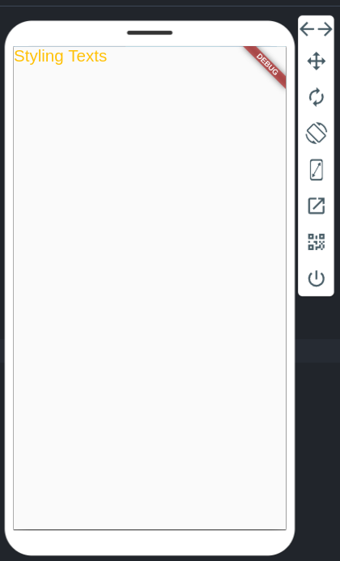

## Column ვიჯეტი
Column ვიჯეტი Flutter_ში გამოიყენება ვიჯეტების ვერტიკალურად განლაგებისათვის. ქვემოთ მოცემულია აპლიკაციის კოდის მაგალითი სადაც, სამი Container ვიჯეტი, Column ვიჯეტის დახმარებით ვერტიკალურად დავალაგეთ ზემოდან ქვემოთ. (ამ მაგალითში კონტეინერ ვიჯეტებს კვადრატების დასახატად ვიყენებთ)

იმისათვის, რომ Column ვიჯეტს მივუთითოთ თუ რომელი ვიჯეტები დაალაგოს ვერტიკალურად ვიყენებთ children პარამეტრს. children პარამეტრის მნიშვნელობა არის სია, ხოლო სიის ელემენტების მონაცემის ტიპი გახლავთ Widget. (ანუ სიში შეგვიძლია გვქონდეს ნებისმიერი ვიჯეტი).

```dart

import 'package:flutter/material.dart';

void main() {
  runApp(MyApp());
}

class MyApp extends StatelessWidget {
  @override
  Widget build(BuildContext context) {
    return MaterialApp(
      home: Scaffold(
        body: Column(
          children: [
            Container(
              color: Colors.red,
              width: 100,
              height: 100,
            ),
            Container(
              color: Colors.green,
              width: 100,
              height: 100,
            ),
            Container(
              color: Colors.blue,
              width: 100,
              height: 100,
            ),
          ],
        ),
      ),
    );
  }
}

```

აპლიკაციის გაშვების შემდეგ გამოჩნდება:

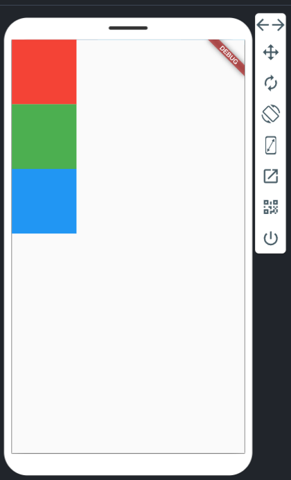

Column ვიჯეტს რამდენიმე მნიშვნელოვანი თვისება აქვს:
- Column ვიჯეტი ვერტიკალურად ეკრანზე არსებულ თავისუფალ ადგილს იკავებს სრულად
- Column ვიჯეტი ჰორიზონტალურად მხოლოდ იმხელა ადგილს იკავებს, რამდენიც მის ყველაზე განიერ შვილ ვიჯეტს სჭირდება (ჩვენს მაგალითში ეს იქნება ასი ერთეული)
- Column ვიჯეტს აქვს მთავარი(ვერტიკალური) და არა მთავარი(ჰორიზონტალური) ღერძი


როგორც უკვე აღვნიშნეთ, Column ვიჯეტი ვერტიკალურად სრულად იკავებს თავისუფალ ადგილს ხოლო ჰორიზონტალურად იმდენს რამდენიც მის შვილ ვიჯეტებს სჭირდება. ეს თვისება კარგად გამოჩნდება თუკი Column ვიჯეტს ჩავსვავთ Container ვიჯეტში და მივანიჭებთ უკანა ფონის ფერს. ასევე ერთერთ შვილ Container ვიჯეტს გავუწეროთ განსხვავებული width პარამეტრის მნიშვნელობა.

```dart

import 'package:flutter/material.dart';

void main() {
  runApp(MyApp());
}

class MyApp extends StatelessWidget {
  @override
  Widget build(BuildContext context) {
    return MaterialApp(
      home: Scaffold(
        body: Container(
          color: Colors.grey,
          child: Column(
            children: [
              Container(
                color: Colors.red,
                width: 100,
                height: 100,
              ),
              Container(
                color: Colors.green,
                width: 300,
                height: 100,
              ),
              Container(
                color: Colors.blue,
                width: 200,
                height: 100,
              ),
            ],
          ),
        ),
      ),
    );
  }
}

```

ამ მაგალითში: 
- Column ვიჯეტი ჩავსვით Container ვიჯეტში
- Container ვიჯეტის დახმარებით Column ვიჯეტს მივანიჭეთ უკანა ფონის ფერი - ნაცრისფერი
- Column ვიჯეტის მეორე შვილის width პარამეტრს მივანიჭეთ 300 ერთეული, ხოლო მესამეს 200

მოცემული კოდის გაშვების შემდეგ ეკრანზე გამოჩნდება:

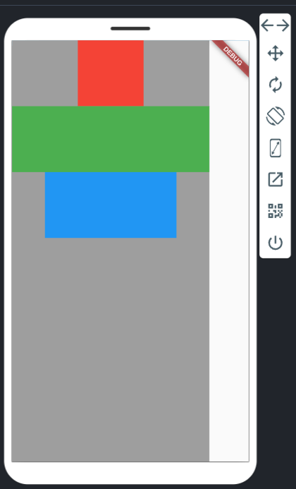

მიაქციე ყურადღება რომ:
- Column ვიჯეტის უკანა ფონის ფერი შეიცვალა
- Column ვიჯეტი მთლიანად იკავებს ვერტიკალურ თავისუფალ ადგილს
- Column ვიჯეტი მხოლოდ იმხელა ადგილს იკავებს ჰორიზონტალურად რამხელაც მის ყველაზე განიერ შვილს სჭირდება (300 ერთეული)

## Column ვიჯეტის mainAxisAlignment პარამეტრი

Column ვიჯეტის mainAxisAlignment პარამეტრის დახმარებით შეგვიძლია ვაკონტროლოთ შვილი ვიჯეტების განლაგება ვერტიკალურად. mainAxisAlignment პარამეტრს შეგვიძლია მივანიჭოთ შემდეგი მნიშვნელობები

1. MainAxisAlignment.start - შვილ ელემენტებს განალაგებს Column ვიჯეტში ზემოთ (default მნიშვნელობა)
2. MainAxisAlignment.center - შვილ ელემენტებს განალაგებს Column ვიჯეტის ცენტრში ვერტიკალურად.
3. MainAxisAlignment.end - შვილ ელემენტებს განალაგებს Column ვიჯეტში ქვემოთ.
4. MainAxisAlignment.spaceAround - შვილი ელემენტების გარშემო(ზემოთ და ქვემოთ) თავისუფალ ადგილს თანაბრად ანაწილებს
5. MainAxisAlignment.spaceBetween - შვილ ელემენტებს შორის თავისუფალ ადგილს თანაბრად ანაწილებს
6. MainAxisAlignment.spaceEvenly - შვილ ელემენტებსა და Column ვიჯეტის კიდეებს შორის თავისუფალ ადგილს თანაბრად ანაწილებს

ქვემოთ ვნახავთ Column ვიჯეტების კოდის მაგალითებსა და შესაბამის სურათებს, ზემოთ ნახსენები MainAxisAlignment მნიშვნელობებით

### MainAxisAlignment.start

```dart
import 'package:flutter/material.dart';

void main() {
  runApp(MyApp());
}

class MyApp extends StatelessWidget {
  @override
  Widget build(BuildContext context) {
    return MaterialApp(
      home: Scaffold(
        body: Container(
          color: Colors.grey,
          child: Column(
            mainAxisAlignment: MainAxisAlignment.start,
            children: [
              Container(
                color: Colors.red,
                width: 100,
                height: 100,
              ),
              Container(
                color: Colors.green,
                width: 300,
                height: 100,
              ),
              Container(
                color: Colors.blue,
                width: 200,
                height: 100,
              ),
            ],
          ),
        ),
      ),
    );
  }
}

```


### MainAxisAlignment.center

```dart
import 'package:flutter/material.dart';

void main() {
  runApp(MyApp());
}

class MyApp extends StatelessWidget {
  @override
  Widget build(BuildContext context) {
    return MaterialApp(
      home: Scaffold(
        body: Container(
          color: Colors.grey,
          child: Column(
            mainAxisAlignment: MainAxisAlignment.center,
            children: [
              Container(
                color: Colors.red,
                width: 100,
                height: 100,
              ),
              Container(
                color: Colors.green,
                width: 300,
                height: 100,
              ),
              Container(
                color: Colors.blue,
                width: 200,
                height: 100,
              ),
            ],
          ),
        ),
      ),
    );
  }
}

```

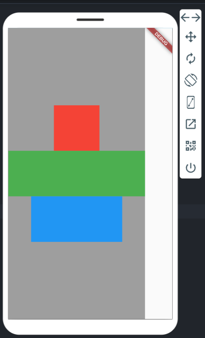


### MainAxisAlignment.end

```dart
import 'package:flutter/material.dart';

void main() {
  runApp(MyApp());
}

class MyApp extends StatelessWidget {
  @override
  Widget build(BuildContext context) {
    return MaterialApp(
      home: Scaffold(
        body: Container(
          color: Colors.grey,
          child: Column(
            mainAxisAlignment: MainAxisAlignment.end,
            children: [
              Container(
                color: Colors.red,
                width: 100,
                height: 100,
              ),
              Container(
                color: Colors.green,
                width: 300,
                height: 100,
              ),
              Container(
                color: Colors.blue,
                width: 200,
                height: 100,
              ),
            ],
          ),
        ),
      ),
    );
  }
}

```

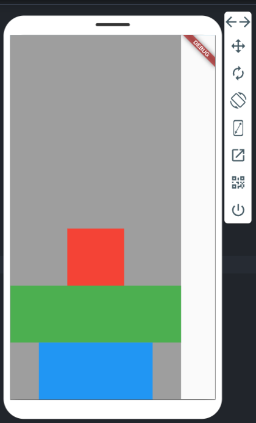


### MainAxisAlignment.spaceAround

```dart
import 'package:flutter/material.dart';

void main() {
  runApp(MyApp());
}

class MyApp extends StatelessWidget {
  @override
  Widget build(BuildContext context) {
    return MaterialApp(
      home: Scaffold(
        body: Container(
          color: Colors.grey,
          child: Column(
            mainAxisAlignment: MainAxisAlignment.spaceAround,
            children: [
              Container(
                color: Colors.red,
                width: 100,
                height: 100,
              ),
              Container(
                color: Colors.green,
                width: 300,
                height: 100,
              ),
              Container(
                color: Colors.blue,
                width: 200,
                height: 100,
              ),
            ],
          ),
        ),
      ),
    );
  }
}

```

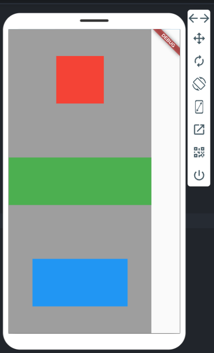

### MainAxisAlignment.spaceBetween

```dart
import 'package:flutter/material.dart';

void main() {
  runApp(MyApp());
}

class MyApp extends StatelessWidget {
  @override
  Widget build(BuildContext context) {
    return MaterialApp(
      home: Scaffold(
        body: Container(
          color: Colors.grey,
          child: Column(
            mainAxisAlignment: MainAxisAlignment.spaceBetween,
            children: [
              Container(
                color: Colors.red,
                width: 100,
                height: 100,
              ),
              Container(
                color: Colors.green,
                width: 300,
                height: 100,
              ),
              Container(
                color: Colors.blue,
                width: 200,
                height: 100,
              ),
            ],
          ),
        ),
      ),
    );
  }
}

```
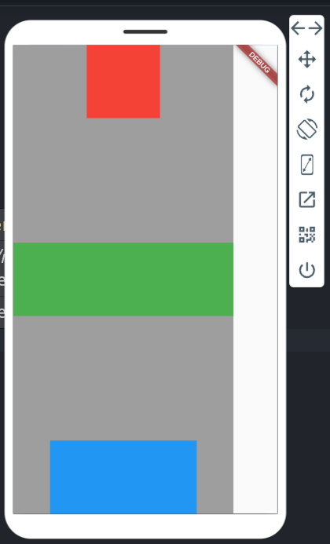

### MainAxisAlignment.spaceEvenly

```dart
import 'package:flutter/material.dart';

void main() {
  runApp(MyApp());
}

class MyApp extends StatelessWidget {
  @override
  Widget build(BuildContext context) {
    return MaterialApp(
      home: Scaffold(
        body: Container(
          color: Colors.grey,
          child: Column(
            mainAxisAlignment: MainAxisAlignment.spaceEvenly,
            children: [
              Container(
                color: Colors.red,
                width: 100,
                height: 100,
              ),
              Container(
                color: Colors.green,
                width: 300,
                height: 100,
              ),
              Container(
                color: Colors.blue,
                width: 200,
                height: 100,
              ),
            ],
          ),
        ),
      ),
    );
  }
}

```
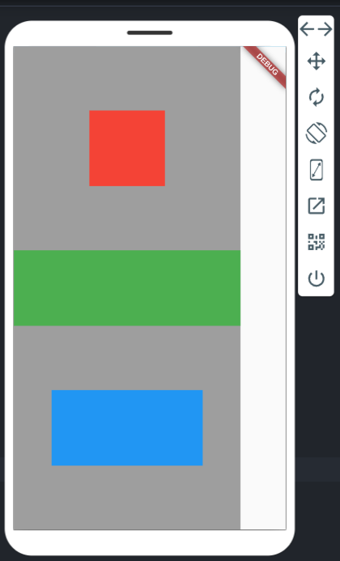

## Column ვიჯეტის crossAxisAlignment პარამეტრი


Column ვიჯეტის crossAxisAlignment პარამეტრის დახმარებით შეგვიძლია ვაკონტროლოთ შვილი ვიჯეტების განლაგება ჰორიზონტალურად. crossAxisAlignment პარამეტრს შეგვიძლია მივანიჭოთ შემდეგი მნიშვნელობები

CrossAxisAlignment.start - შვილ ელემენტებს განალაგებს Column ვიჯეტში მარცხნივ
CrossAxisAlignment.center - შვილ ელემენტებს განალაგებს Column ვიჯეტის ცენტრში ჰორიზონტალურად(default მნიშვნელობა).
CrossAxisAlignment.end - შვილ ელემენტებს განალაგებს Column ვიჯეტში მარჯვნივ.

ქვემოთ ვნახავთ Column ვიჯეტების კოდის მაგალითებსა და შესაბამის სურათებს, ზემოთ ნახსენები CrossAxisAlignment მნიშვნელობებით

### CrossAxisAlignment.start

```dart
import 'package:flutter/material.dart';

void main() {
  runApp(MyApp());
}

class MyApp extends StatelessWidget {
  @override
  Widget build(BuildContext context) {
    return MaterialApp(
      home: Scaffold(
        body: Container(
          color: Colors.grey,
          child: Column(
            crossAxisAlignment: CrossAxisAlignment.start,
            children: [
              Container(
                color: Colors.red,
                width: 100,
                height: 100,
              ),
              Container(
                color: Colors.green,
                width: 300,
                height: 100,
              ),
              Container(
                color: Colors.blue,
                width: 200,
                height: 100,
              ),
            ],
          ),
        ),
      ),
    );
  }
}

```
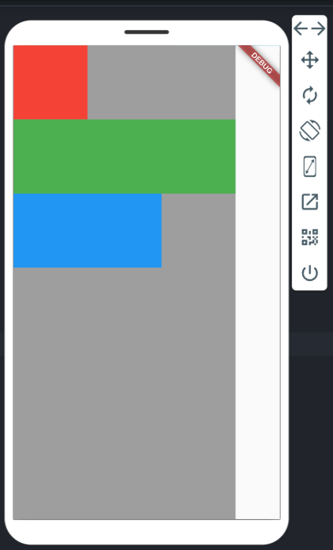


### CrossAxisAlignment.center

```dart
import 'package:flutter/material.dart';

void main() {
  runApp(MyApp());
}

class MyApp extends StatelessWidget {
  @override
  Widget build(BuildContext context) {
    return MaterialApp(
      home: Scaffold(
        body: Container(
          color: Colors.grey,
          child: Column(
            crossAxisAlignment: CrossAxisAlignment.center,
            children: [
              Container(
                color: Colors.red,
                width: 100,
                height: 100,
              ),
              Container(
                color: Colors.green,
                width: 300,
                height: 100,
              ),
              Container(
                color: Colors.blue,
                width: 200,
                height: 100,
              ),
            ],
          ),
        ),
      ),
    );
  }
}

```
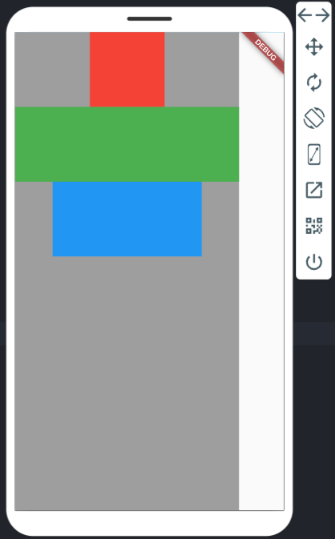

### CrossAxisAlignment.end

```dart
import 'package:flutter/material.dart';

void main() {
  runApp(MyApp());
}

class MyApp extends StatelessWidget {
  @override
  Widget build(BuildContext context) {
    return MaterialApp(
      home: Scaffold(
        body: Container(
          color: Colors.grey,
          child: Column(
            crossAxisAlignment: CrossAxisAlignment.end,
            children: [
              Container(
                color: Colors.red,
                width: 100,
                height: 100,
              ),
              Container(
                color: Colors.green,
                width: 300,
                height: 100,
              ),
              Container(
                color: Colors.blue,
                width: 200,
                height: 100,
              ),
            ],
          ),
        ),
      ),
    );
  }
}

```
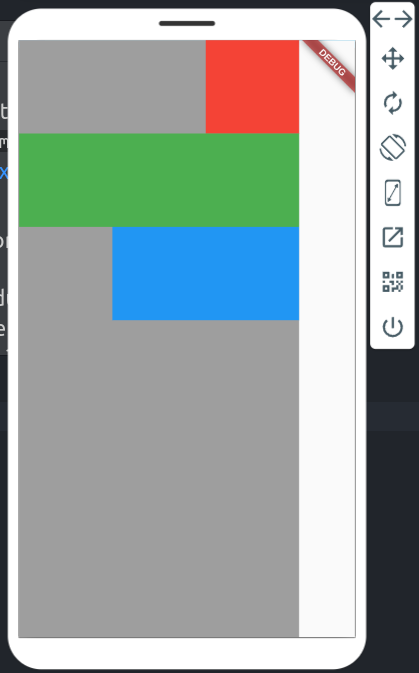

## Row ვიჯეტი

Row ვიჯეტი Flutter_ში გამოიყენება ვიჯეტების ჰორიზონტალურად განლაგებისათვის. სურათზე მოცემულია სამი Container ვიჯეტი, რომელიც Row ვიჯეტის დახმარებით ჰორიზონტალურად დავალაგეთ მარცხნიდან მარჯვნივ. 

```dart
import 'package:flutter/material.dart';

void main() {
  runApp(MyApp());
}

class MyApp extends StatelessWidget {
  @override
  Widget build(BuildContext context) {
    return MaterialApp(
      home: Scaffold(
        body: Row(
          children: [
            Container(
              color: Colors.red,
              width: 100,
              height: 100,
            ),
            Container(
              color: Colors.green,
              width: 100,
              height: 100,
            ),
            Container(
              color: Colors.blue,
              width: 100,
              height: 100,
            ),
          ],
        ),
      ),
    );
  }
}

```


აპლიკაციის გაშვების შემდეგ გამოჩნდება:

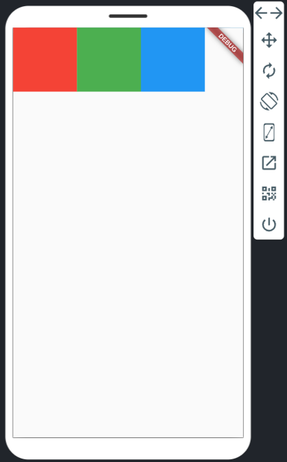

Row ვიჯეტს რამდენიმე მნიშვნელოვანი თვისება აქვს:
- Row ვიჯეტი ჰორიზონტალურად ეკრანზე არსებულ თავისუფალ ადგილს იკავებს სრულად
- Row ვიჯეტი ვერტიკალურად მხოლოდ იმხელა ადგილს იკავებს, რამდენიც მის ყველაზე მაღალ შვილ ვიჯეტს სჭირდება (ჩვენს მაგალითში ეს იქნება ასი ერთეული)
- Row ვიჯეტს აქვს მთავარი(ჰორიზონტალური) და არა მთავარი(ვერტიკალური) ღერძი


როგორც უკვე აღვნიშნეთ, Row ვიჯეტი ჰორიზონტალურად სრულად იკავებს თავისუფალ ადგილს ხოლო ვერტიკალურად იმდენს რამდენიც მის შვილ ვიჯეტებს სჭირდება. ეს თვისება კარგად გამოჩნდება თუკი Row ვიჯეტს ჩავსვავთ Container ვიჯეტში და მივანიჭებთ უკანა ფონის ფერს. ასევე ერთერთ შვილ Container ვიჯეტს გავუწეროთ განსხვავებული height პარამეტრის მნიშვნელობა.

```dart
import 'package:flutter/material.dart';

void main() {
  runApp(MyApp());
}

class MyApp extends StatelessWidget {
  @override
  Widget build(BuildContext context) {
    return MaterialApp(
      home: Scaffold(
        body: Container(
          color: Colors.grey,
          child: Row(
            children: [
              Container(
                color: Colors.red,
                width: 100,
                height: 100,
              ),
              Container(
                color: Colors.green,
                width: 100,
                height: 300,
              ),
              Container(
                color: Colors.blue,
                width: 100,
                height: 200,
              ),
            ],
          ),
        ),
      ),
    );
  }
}

```

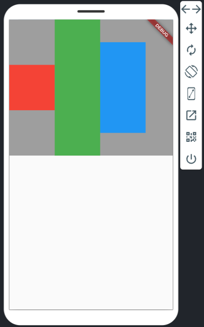

Row ვიჯეტის mainAxisAlignment პარამეტრის დახმარებით შეგვიძლია ვაკონტროლოთ შვილი ვიჯეტების განლაგება ჰორიზონტალურად. mainAxisAlignment პარამეტრს შეგვიძლია მივანიჭოთ შემდეგი მნიშვნელობები

- MainAxisAlignment.start - შვილ ელემენტებს განალაგებს Row ვიჯეტში მარცხნივ (default მნიშვნელობა)
- MainAxisAlignment.center - შვილ ელემენტებს განალაგებს Row ვიჯეტის ცენტრში ჰორიზონტალურად.
- MainAxisAlignment.end - შვილ ელემენტებს განალაგებს Row ვიჯეტში მარჯვნივ.
- MainAxisAlignment.spaceAround - შვილი ელემენტების გარშემო(მარცხნივ და მარჯვნივ) თავისუფალ ადგილს თანაბრად ანაწილებს.
- MainAxisAlignment.spaceBetween - შვილ ელემენტებს შორის თავისუფალ ადგილს თანაბრად ანაწილებს
- MainAxisAlignment.spaceEvenly - შვილ ელემენტებსა და Row ვიჯეტის კიდეებს შორის თავისუფალ ადგილს თანაბრად ანაწილებს

ქვემოთ ვნახავთ Row ვიჯეტების კოდის მაგალითებსა და შესაბამის სურათებს, ზემოთ ნახსენები MainAxisAlignment მნიშვნელობებით

### MainAxisAlignment.start

```dart
import 'package:flutter/material.dart';

void main() {
  runApp(MyApp());
}

class MyApp extends StatelessWidget {
  @override
  Widget build(BuildContext context) {
    return MaterialApp(
      home: Scaffold(
        body: Container(
          color: Colors.grey,
          child: Row(
            mainAxisAlignment: MainAxisAlignment.start,
            children: [
              Container(
                color: Colors.red,
                width: 100,
                height: 100,
              ),
              Container(
                color: Colors.green,
                width: 100,
                height: 300,
              ),
              Container(
                color: Colors.blue,
                width: 100,
                height: 200,
              ),
            ],
          ),
        ),
      ),
    );
  }
}

```


### MainAxisAlignment.center

```dart
import 'package:flutter/material.dart';

void main() {
  runApp(MyApp());
}

class MyApp extends StatelessWidget {
  @override
  Widget build(BuildContext context) {
    return MaterialApp(
      home: Scaffold(
        body: Container(
          color: Colors.grey,
          child: Row(
            mainAxisAlignment: MainAxisAlignment.center,
            children: [
              Container(
                color: Colors.red,
                width: 100,
                height: 100,
              ),
              Container(
                color: Colors.green,
                width: 100,
                height: 300,
              ),
              Container(
                color: Colors.blue,
                width: 100,
                height: 200,
              ),
            ],
          ),
        ),
      ),
    );
  }
}

```

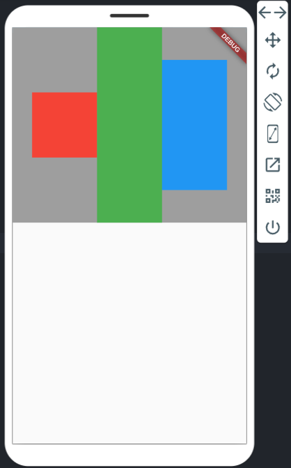

### MainAxisAlignment.end

```dart
import 'package:flutter/material.dart';

void main() {
  runApp(MyApp());
}

class MyApp extends StatelessWidget {
  @override
  Widget build(BuildContext context) {
    return MaterialApp(
      home: Scaffold(
        body: Container(
          color: Colors.grey,
          child: Row(
            mainAxisAlignment: MainAxisAlignment.end,
            children: [
              Container(
                color: Colors.red,
                width: 100,
                height: 100,
              ),
              Container(
                color: Colors.green,
                width: 100,
                height: 300,
              ),
              Container(
                color: Colors.blue,
                width: 100,
                height: 200,
              ),
            ],
          ),
        ),
      ),
    );
  }
}

```

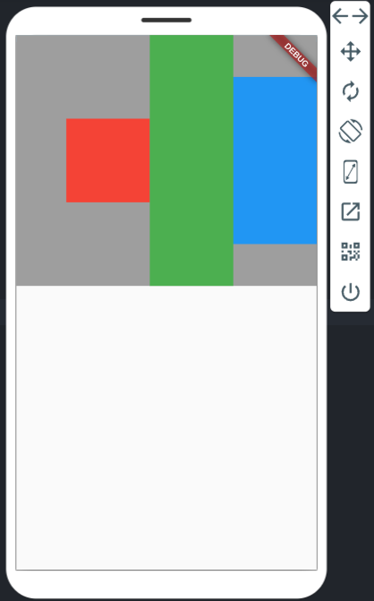

### MainAxisAlignment.spaceAround

```dart
import 'package:flutter/material.dart';

void main() {
  runApp(MyApp());
}

class MyApp extends StatelessWidget {
  @override
  Widget build(BuildContext context) {
    return MaterialApp(
      home: Scaffold(
        body: Container(
          color: Colors.grey,
          child: Row(
            mainAxisAlignment: MainAxisAlignment.spaceAround,
            children: [
              Container(
                color: Colors.red,
                width: 100,
                height: 100,
              ),
              Container(
                color: Colors.green,
                width: 100,
                height: 300,
              ),
              Container(
                color: Colors.blue,
                width: 100,
                height: 200,
              ),
            ],
          ),
        ),
      ),
    );
  }
}

```


### MainAxisAlignment.spaceBetween

```dart
import 'package:flutter/material.dart';

void main() {
  runApp(MyApp());
}

class MyApp extends StatelessWidget {
  @override
  Widget build(BuildContext context) {
    return MaterialApp(
      home: Scaffold(
        body: Container(
          color: Colors.grey,
          child: Row(
            mainAxisAlignment: MainAxisAlignment.spaceBetween,
            children: [
              Container(
                color: Colors.red,
                width: 100,
                height: 100,
              ),
              Container(
                color: Colors.green,
                width: 100,
                height: 300,
              ),
              Container(
                color: Colors.blue,
                width: 100,
                height: 200,
              ),
            ],
          ),
        ),
      ),
    );
  }
}

```

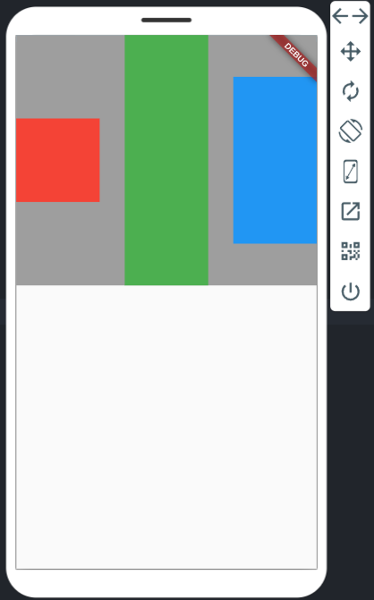

### MainAxisAlignment.spaceEvenly

```dart
import 'package:flutter/material.dart';

void main() {
  runApp(MyApp());
}

class MyApp extends StatelessWidget {
  @override
  Widget build(BuildContext context) {
    return MaterialApp(
      home: Scaffold(
        body: Container(
          color: Colors.grey,
          child: Row(
            mainAxisAlignment: MainAxisAlignment.spaceEvenly,
            children: [
              Container(
                color: Colors.red,
                width: 100,
                height: 100,
              ),
              Container(
                color: Colors.green,
                width: 100,
                height: 300,
              ),
              Container(
                color: Colors.blue,
                width: 100,
                height: 200,
              ),
            ],
          ),
        ),
      ),
    );
  }
}

```

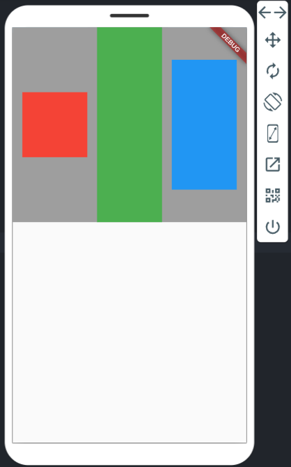

Row ვიჯეტის crossAxisAlignment პარამეტრის დახმარებით შეგვიძლია ვაკონტროლოთ შვილი ვიჯეტების განლაგება ვერტიკალურად. crossAxisAlignment პარამეტრს შეგვიძლია მივანიჭოთ შემდეგი მნიშვნელობები

1. CrossAxisAlignment.start - შვილ ელემენტებს განალაგებს Row ვიჯეტში ზემოთ
2. CrossAxisAlignment.center - შვილ ელემენტებს განალაგებს Row ვიჯეტის ცენტრში ვერტიკალურად(default მნიშვნელობა).
3. CrossAxisAlignment.end - შვილ ელემენტებს განალაგებს Row ვიჯეტში ქვემოთ.

### CrossAxisAlignment.start

```dart

import 'package:flutter/material.dart';

void main() {
  runApp(MyApp());
}

class MyApp extends StatelessWidget {
  @override
  Widget build(BuildContext context) {
    return MaterialApp(
      home: Scaffold(
        body: Container(
          color: Colors.grey,
          child: Row(
            crossAxisAlignment: CrossAxisAlignment.start,
            children: [
              Container(
                color: Colors.red,
                width: 100,
                height: 100,
              ),
              Container(
                color: Colors.green,
                width: 100,
                height: 300,
              ),
              Container(
                color: Colors.blue,
                width: 100,
                height: 200,
              ),
            ],
          ),
        ),
      ),
    );
  }
}


```

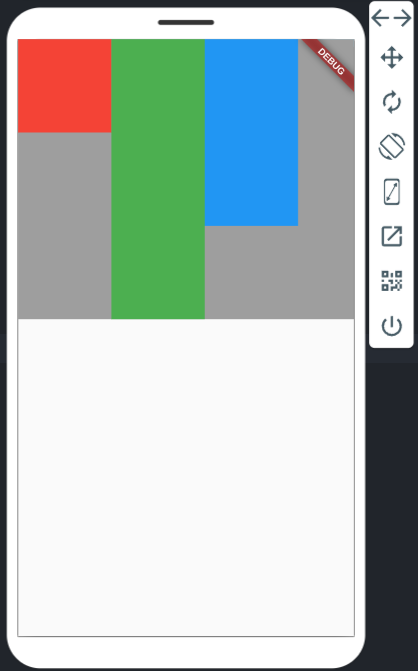


### CrossAxisAlignment.center

```dart

import 'package:flutter/material.dart';

void main() {
  runApp(MyApp());
}

class MyApp extends StatelessWidget {
  @override
  Widget build(BuildContext context) {
    return MaterialApp(
      home: Scaffold(
        body: Container(
          color: Colors.grey,
          child: Row(
            crossAxisAlignment: CrossAxisAlignment.center,
            children: [
              Container(
                color: Colors.red,
                width: 100,
                height: 100,
              ),
              Container(
                color: Colors.green,
                width: 100,
                height: 300,
              ),
              Container(
                color: Colors.blue,
                width: 100,
                height: 200,
              ),
            ],
          ),
        ),
      ),
    );
  }
}


```

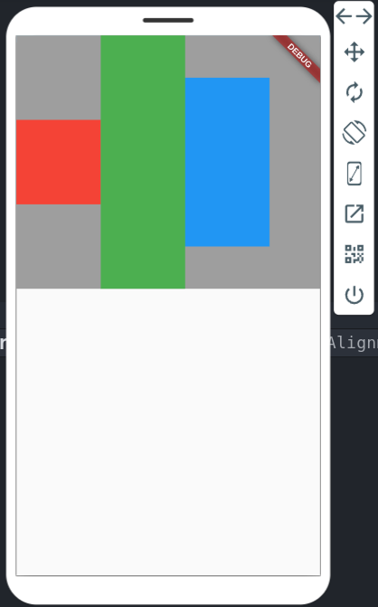

### CrossAxisAlignment.end

```dart

import 'package:flutter/material.dart';

void main() {
  runApp(MyApp());
}

class MyApp extends StatelessWidget {
  @override
  Widget build(BuildContext context) {
    return MaterialApp(
      home: Scaffold(
        body: Container(
          color: Colors.grey,
          child: Row(
            crossAxisAlignment: CrossAxisAlignment.end,
            children: [
              Container(
                color: Colors.red,
                width: 100,
                height: 100,
              ),
              Container(
                color: Colors.green,
                width: 100,
                height: 300,
              ),
              Container(
                color: Colors.blue,
                width: 100,
                height: 200,
              ),
            ],
          ),
        ),
      ),
    );
  }
}


```

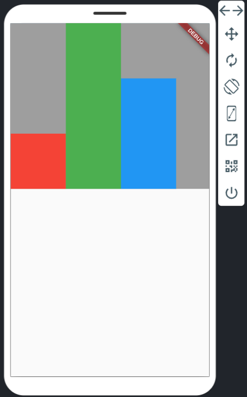

## ტექსტის სტილის ცვლადში შენახვა

ხშირად აპლიკაციის სხვადასხვა ნაწილში გვჭირდება ერდი და იგივე სტილის ტექსტის გამოყენბა. ქვემოთ მოცემულია მაგალითი სადაც გვაქვს სამი Text ვიჯეტი ერთი და იგივე ფონტის ფერითა და ზომით

```dart
import 'package:flutter/material.dart';

void main() {
  runApp(MyApp());
}

class MyApp extends StatelessWidget {
  @override
  Widget build(BuildContext context) {
    return MaterialApp(
      home: Scaffold(
        body: Center(
          child: Column(
            mainAxisAlignment: MainAxisAlignment.center,
            children: [
              Text(
                'Hello!',
                style: TextStyle(
                  fontSize: 22,
                  color: Colors.red,
                ),
              ),
              Text(
                'I am',
                style: TextStyle(
                  fontSize: 22,
                  color: Colors.red,
                ),
              ),
              Text(
                'Flutter App',
                style: TextStyle(
                  fontSize: 22,
                  color: Colors.red,
                ),
              ),
            ],
          ),
        ),
      ),
    );
  }
}

```

როგორც ხედავ სამივე Text ვიჯეტის style პარამეტრს ერთი და იგივე მნიშვნელობა აქვს. ასეთ დროს რეკომენდირებულია საერთო კოდის ცვლადში 'გატანა'. ამისთვის შევქმნით TextStyle მონაცემის ტიპის ცვლადს სახელად myStyle და ამ ცვლადში შევინახავთ TextStyle ობიექტს

```dart

import 'package:flutter/material.dart';

void main() {
  runApp(MyApp());
}

class MyApp extends StatelessWidget {
  TextStyle myStyle = TextStyle(
    fontSize: 22,
    color: Colors.red,
  );

  @override
  Widget build(BuildContext context) {
    return MaterialApp(
      home: Scaffold(
        body: Center(
          child: Column(
            mainAxisAlignment: MainAxisAlignment.center,
            children: [
              Text(
                'Hello!',
                style: myStyle,
              ),
              Text(
                'I am',
                style: myStyle,
              ),
              Text(
                'Flutter App',
                style: myStyle,
              ),
            ],
          ),
        ),
      ),
    );
  }
}


```

როგორც ხედავ ჩვენი Text ვიჯეტების სტილი გავიტანეთ კლასის ცვლადში და სწორად ამ ცვლადს ვიყენებთ Text ვიჯეტის style პარამეტრის მნიშვნელობად.

## ვიჯეტების ფუნქციებში გატანა

ქვემოთ მოცემულია მარტივი Column ვიჯეტის მაგალითი სადაც გვაქვს სამი Container ვიჯეტი ზომებით 100X100_ზე და განსხვავებული ფერებით. მსგავსი სიტუაცია Flutter_ში ხშირად გვხვდება, როცა ერთი და იგივე ან მსგავს ვიჯეტებს ვიყენებთ აპლიკაციის სხვადასხვა ნაწილში.

```dart
import 'package:flutter/material.dart';

void main() {
  runApp(MyApp());
}

class MyApp extends StatelessWidget {
  @override
  Widget build(BuildContext context) {
    return MaterialApp(
      home: Scaffold(
        body: Column(
          crossAxisAlignment: CrossAxisAlignment.end,
          children: [
            Container(
              color: Colors.red,
              width: 100,
              height: 100,
            ),
            Container(
              color: Colors.green,
              width: 100,
              height: 100,
            ),
            Container(
              color: Colors.blue,
              width: 100,
              height: 100,
            ),
          ],
        ),
      ),
    );
  }
}

```

იმისათვის, რომ ერთი და იგივე კოდის გამეორება თავიდან ავირიდოთ მოდით შევქმნათ ფუნქცია, რომელიც პარამეტრის სახით მიიღებს ფერს და დააბრუნებს ამ ფერის Container ვიჯეტს ზომებით 100X100. ამ ფუნქციის მარტივად შესაქმნელად შეგვიძლია გამოვიყენოთ Flutter_ის ფუნქციონალი Extract Method. ამისთვის ერთერთ Container ვიჯეტზე მოათავსე კურსორი და დააჭირე ctrl + . კლავიშებს კლავიატურაზე. გამოსულ მენიუში აირჩიე Extract Method და მიანიჭე მეთოდს სახელი. ამის შემდეგ ჩვენს კლასში გაჩნდება ახალი მეთოდი ჩვენს მიერ შერჩეული სახელით და Container ვიჯეტის კოდი შეიცვლება ფუნქციის გამოძახებით:

```dart
import 'package:flutter/material.dart';

void main() {
  runApp(MyApp());
}

class MyApp extends StatelessWidget {
  @override
  Widget build(BuildContext context) {
    return MaterialApp(
      home: Scaffold(
        body: Column(
          crossAxisAlignment: CrossAxisAlignment.end,
          children: [
            coloredBox(),
            Container(
              color: Colors.green,
              width: 100,
              height: 100,
            ),
            Container(
              color: Colors.blue,
              width: 100,
              height: 100,
            ),
          ],
        ),
      ),
    );
  }

  Container coloredBox() {
    return Container(
            color: Colors.red,
            width: 100,
            height: 100,
          );
  }
}

```

ახლა ისღა დაგვრჩენია ჩვენს ფუნქციაში მივიღოთ ფერი პარამეტრის სახით და კონტეინერში რომელსაც ფუნქციაში ვაბრუნებთ ფერის პარამეტრში გადავცეთ ფუნქციის პარამეტრში მიღებული ფერი. ასევე Column ვიჯეტში დარჩენილი ორი კონტეინერი შევცვალოთ ფუნქციის გამოძახებით.

```dart
import 'package:flutter/material.dart';

void main() {
  runApp(MyApp());
}

class MyApp extends StatelessWidget {
  @override
  Widget build(BuildContext context) {
    return MaterialApp(
      home: Scaffold(
        body: Column(
          crossAxisAlignment: CrossAxisAlignment.end,
          children: [
            coloredBox(Colors.red),
            coloredBox(Colors.green),
            coloredBox(Colors.blue),
          ],
        ),
      ),
    );
  }

  Container coloredBox(Color color) {
    return Container(
      color: color,
      width: 100,
      height: 100,
    );
  }
}


```