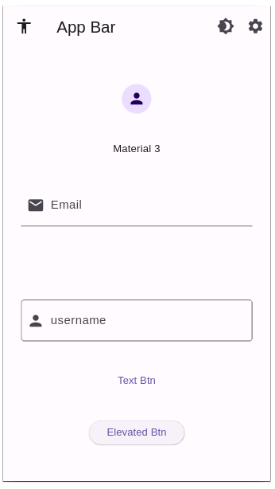
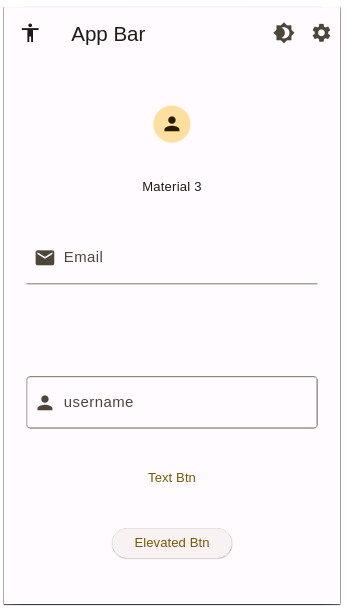
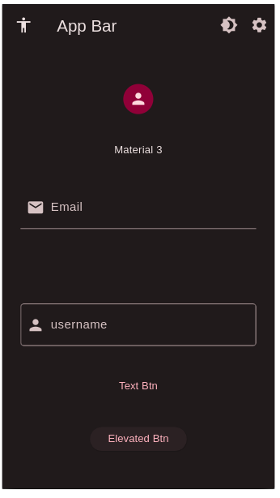
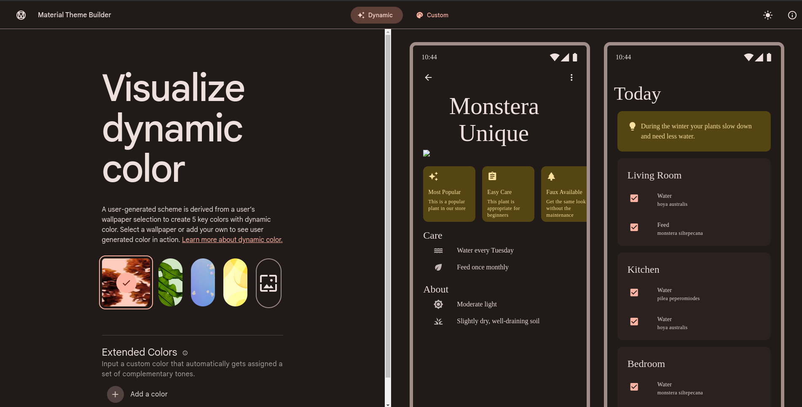
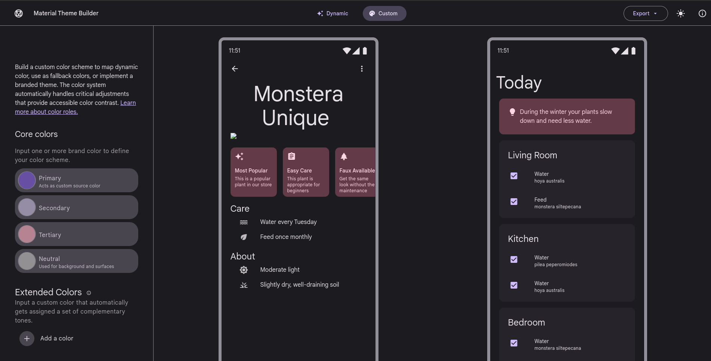
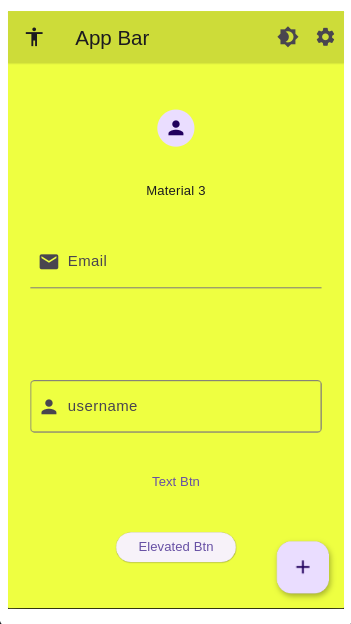
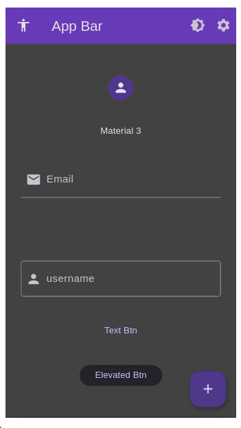

## რა არის Material დიზაინი

Material დიზაინი გუგლის მიერ შექმნილი დიზაინის სისტემაა, რომელიც საშვალებას გვაძლევს მოკლე დროში ზედმეტი ძალისხმევის გარეშე ავაწყოთ თანამედროვე ვიზუალის აპლიკაციები. Material დიზაინი პირველად 2014 წელს გამოჩნდა და მას შემდეგ განუყოფელი ნაწილია თანამედროვე აპლიკაციებისა და ვებ საიტების დეველოპმენტში. დღეისთვის გვაქვს ეგრედწოდებული Material 3 ვერსია, რომლის შესახებ დამატებით ინფორმაციას [m3.material.io](https://m3.material.io/get-started) ლინკზე გაეცნობი. 

ახლა კი მოდით შევქმნათ მარტივი ლეიაუთი და ვნახოთ Material3 დიზაინი მოქმედებაში.

```dart
import 'package:flutter/material.dart';

void main() {
  runApp(const MyApp());
}

class MyApp extends StatelessWidget {
  const MyApp({super.key});

  @override
  Widget build(BuildContext context) {
    return MaterialApp(
      debugShowCheckedModeBanner: false,
      home: const MyHomePage(),
    );
  }
}

class MyHomePage extends StatelessWidget {
  const MyHomePage({super.key});

  @override
  Widget build(BuildContext context) {
    return Scaffold(
      appBar: AppBar(
        title: Text('App Bar'),
        leading: Icon(Icons.accessibility),
        actions: [
          IconButton(
            onPressed: () {},
            icon: Icon(Icons.brightness_4),
          ),
          IconButton(
            onPressed: () {},
            icon: Icon(Icons.settings),
          ),
        ],
      ),
      body: Container(
        margin: EdgeInsets.symmetric(
          horizontal: 24,
          vertical: 12,
        ),
        child: Column(
          mainAxisAlignment: MainAxisAlignment.spaceEvenly,
          children: [
            CircleAvatar(
              child: Icon(Icons.person),
            ),
            Text(
              'Material 3',
            ),
            TextField(
              decoration: InputDecoration(
                label: Text('Email'),
                prefixIcon: Icon(
                  Icons.mail,
                ),
              ),
            ),
            SizedBox(
              height: 24,
            ),
            TextField(
              decoration: InputDecoration(
                label: Text('username'),
                border: OutlineInputBorder(),
                prefixIcon: Icon(Icons.person),
              ),
            ),
            TextButton(
              onPressed: () {},
              child: Text('Text Btn'),
            ),
            ElevatedButton(
              onPressed: () {},
              child: Text('Elevated Btn'),
            ),
          ],
        ),
      ),
    );
  }
}


```


თუკი მოცემულ კოდს შენს პროექტში გადაიტან და ემულატორზე გაუშვებ, ეკრანზე აქამდე ნასწავლი ვიჯეტები გამოჩნდება. ახლა მოდით ვნახოთ როგორ შეგვიძლია მარტივად შევცვალოთ ჩვენი აპლიკაციის ფერები. პირველ რიგში MaterialApp ვიჯეტის პარამეტრს theme_ს გავეცნობით. theme პარამეტრს მნიშვნელობად გადავცემთ ThemeData ობიექტს, რომელშიც შეგვიძლია აღვწეროთ ყველა იმ ვიჯეტის დიზაინი რომლელსაც ჩვენს აპლიკაციაში ვიყენებთ. თავისმხრივ ThemeData ობიექტს გადავაწვდით colorSchemeSeed პარამეტრს.
ამ ცვლილებების შემდეგ MyApp ვიჯეტი რომელშიც MaterialApp ვიჯეტი გვაქვს ასე გამოიყურება:

```dart

class MyApp extends StatelessWidget {
  const MyApp({super.key});

  @override
  Widget build(BuildContext context) {
    return MaterialApp(
      debugShowCheckedModeBanner: false,
      theme: ThemeData(
        colorSchemeSeed: Colors.amber,
      ),
      home: const MyHomePage(),
    );
  }
}

```

ხოლო ჩვენი აპლიკაციის ვიზუალი ასე:



Flutter_ში ვიჯეტები default_ად იყენებენ გარკვეულ ფერებს, რომელსაც colorSchemeSeed პარამეტრში გადაცემული ფერით ჩვენ გადავაწერეთ ახალი მნიშვნელობა. ახლა მოდით ვნახოთ როგორ შეგვიძლია შემოვიტანოთ ჩვენს აპლიკაციებში dark mode_ი 

## Light & Dark mode
იმისათვის, რომ აპლიკაციაში გვქონდეს ორი რეჟიმი (დღის და ღამის) ჩვენ ეს რეჟიმები უნდა აღვწეროთ MaterialApp ვიჯეტში. light mode დიზაინს ჩვენ theme პარამეტრში გადავცემთ, ხოლო dark mode დიზაინს შესაბამისად darkTheme პარამეტრში გადავაწოდებთ. themeMode პარამეტრის დახმარებით კი შეგვიძლია ჩვენს აპლიკაციას ვუთხრათ თუ რომელი რეჟიმი გვინდა გამოვიყენოთ. 

```dart

class MyApp extends StatelessWidget {
  const MyApp({super.key});

  @override
  Widget build(BuildContext context) {
    return MaterialApp(
      debugShowCheckedModeBanner: false,
      theme: ThemeData(
        colorSchemeSeed: Colors.amber,
      ),
      darkTheme: ThemeData(
        colorSchemeSeed: Colors.pink,
      ),
      themeMode: ThemeMode.dark,
      home: MyHomePage(),
    );
  }
}

```
ემულატორზე თუ კი ორივე theme და darkTheme პარამეტრებს გადავაწოდებთ default_ად themeMode პარამეტრის მითითების გარეშე ჩვენი აპლიკაცია ღამის რეჟიმზე იქნება. (ამ შემთხვევაში მხოლოდ განსხვავებულ ფერებს ვიყენებთ ჩვენი ვიჯეტებისათვის). იმისათვის, რომ ღამის რეჟიმ ისე გამოიყურებოდეს, როგორც სხვა აპლიკაციებში გვინახავს, გვჭირდება კიდევ ერთი პარამეტრი: brightness


```dart
class MyApp extends StatelessWidget {
  const MyApp({super.key});

  @override
  Widget build(BuildContext context) {
    return MaterialApp(
      debugShowCheckedModeBanner: false,
      theme: ThemeData(
        colorSchemeSeed: Colors.amber,
        brightness: Brightness.light,
      ),
      darkTheme: ThemeData(
        colorSchemeSeed: Colors.pink,
        brightness: Brightness.dark,
      ),
      themeMode: ThemeMode.dark,
      home: MyHomePage(),
    );
  }
}
```

როგორც ხედავ ThemeData ობიექტებს დავამატეთ brightness პარამეტრი შესაბამისი მნიშვნელობებით. ამის შემდეგ, ჩვენი აპლიკაცია ღამის რეჟიმში ვიჯეტების უკანაფონის მნიშვნელობად მუქ ფერებს გამოიყენებს:



ახლა მოდით ვნახოთ, როგორ შეგვიძლია მომხმარებელს მივცეთ საშვალება შეცვალოს აპლიკაციის რეჟიმი. ვიჯეტის state_ის ცვლილებაზე შენ აქამდეც გიმუშავია, თუმცა ახლა განსხვავებული შემთხვევა გვაქვს. ინფორმაცია, რომელიც გვინდა შეიცვალოს MyApp ვიჯეტშია, ხოლო ვიჯეტი რომელმაც ეს state_ი უნდა შეცვალოს MyHomePage ვიჯეტში იმყოფება.
ამ ამოცანის გადაჭრის სხვადასხვა გზა არსებობს და ჩვენ ამ გზებიდან ერთერთს შევისწავლით:

- პირველ რიგში MyApp ვიჯეტი უნდა გადავაქციოთ StatefulWidget_ად
- სასურველი ინფორმაცია გავიტანოთ ცვლადში
- MyApp ვიჯეტში შევქმნათ ფუნქცია, რომელიც პასუხისმგებელი იქნება themeMode პარამეტრის მნიშვნელობის ცვლილებაზე (changing state)
- MyHomePage ვიჯეტში აღვწეროთ ცვლადი, რომელიც კონსტრუქტორიდან მნიშვნელობად მიიღებს ფუნქციას.
- AppBar ვიჯეტში აღწერილ ერთერთ ღილაკზე დაჭერისას გამოვიძახოთ ეს ფუნქცია.

ამ ცვლილებების შემდეგ ჩვენი აპლიკაციის კოდი ასე გამოიყურება:

```dart
import 'package:flutter/material.dart';

void main() {
  runApp(const MyApp());
}

class MyApp extends StatefulWidget {
  const MyApp({super.key});

  @override
  State<MyApp> createState() => _MyAppState();
}

class _MyAppState extends State<MyApp> {
  ThemeMode themeMode = ThemeMode.light;

  void changeThemeMode() {
    setState(() {
      if (themeMode == ThemeMode.light) {
        themeMode = ThemeMode.dark;
      } else {
        themeMode = ThemeMode.light;
      }
    });
  }

  @override
  Widget build(BuildContext context) {
    return MaterialApp(
      debugShowCheckedModeBanner: false,
      theme: ThemeData(
        colorSchemeSeed: Colors.amber,
        brightness: Brightness.light,
      ),
      darkTheme: ThemeData(
        colorSchemeSeed: Colors.pink,
        brightness: Brightness.dark,
      ),
      themeMode: themeMode,
      home: MyHomePage(
        changeTheme: changeThemeMode,
      ),
    );
  }
}

class MyHomePage extends StatelessWidget {
  const MyHomePage({
    super.key,
    required this.changeTheme,
  });

  final Function() changeTheme;

  @override
  Widget build(BuildContext context) {
    return Scaffold(
      appBar: AppBar(
        title: Text('App Bar'),
        leading: Icon(Icons.accessibility),
        actions: [
          IconButton(
            onPressed: changeTheme,
            icon: Icon(Icons.brightness_4),
          ),
          IconButton(
            onPressed: () {},
            icon: Icon(Icons.settings),
          ),
        ],
      ),
      body: Container(
        margin: EdgeInsets.symmetric(
          horizontal: 24,
          vertical: 12,
        ),
        child: Column(
          mainAxisAlignment: MainAxisAlignment.spaceEvenly,
          children: [
            CircleAvatar(
              child: Icon(Icons.person),
            ),
            Text(
              'Material 3',
            ),
            TextField(
              decoration: InputDecoration(
                label: Text('Email'),
                prefixIcon: Icon(
                  Icons.mail,
                ),
              ),
            ),
            SizedBox(
              height: 24,
            ),
            TextField(
              decoration: InputDecoration(
                label: Text('username'),
                border: OutlineInputBorder(),
                prefixIcon: Icon(Icons.person),
              ),
            ),
            TextButton(
              onPressed: () {},
              child: Text('Text Btn'),
            ),
            ElevatedButton(
              onPressed: () {},
              child: Text('Elevated Btn'),
            ),
          ],
        ),
      ),
    );
  }
}


```

ყურადღებით გადახედე შეტანილ ცვლილებებს. როგორც ხედავ MyHomePage ვიჯეტში დავამატეთ ცვლადი რომლის მონაცემის ტიპი არის Function(), სახელი კი changeTheme. მსგავსი სინტაქსი აქამდე არ გამოგვიყენებია და მნიშვნელოვანია გავიაზროთ, რომ დარტში შეგვიძლია ცვლადების მნიშვნელობად გვქონდეს ფუნქციებიც. 
საბოლოო ჯამში MyHomePage ვიჯეტს გადავაწოდეთ ფუნქციის სახელი, რომელიც MyApp ვიჯეტში გვაქვს აღწერილი. AppBar ვიჯეტში არსებულ IconButton ვიჯეტზე დაჭერისას ჩვენ სწორედ ამ ფუნქციის სახელს გადავცემთ. (აქ ფუნქციას არ ვიძახებთ) ფუნქციას Flutter_ი გამოიძახებს როდესაც ღოლაკზე დაეჭირება. ამ ცვლილებების შემდეგ brightness იქონზე დაჭერისას ჩვენი აპლიკაცია შეიცვლის themeMode_ს.

## material3 theme generator
colorSchemeSeed პარამეტრის ალტერნატივად შეგვიძლია გამოვიყენოთ [m3.material.io](https://m3.material.io/theme-builder#/dynamic) პლატფორმა. ამ საიტზე გვაქვს ორი არჩევანი: 
1. Dynamic - ჩვენი აპლიკაციების ფერები დავაგენერიროთ რამე სურათიდან (მაგალითად ეს სურათი შეიძლება იყოს აპლიკაციის ლოგო)


2. Custom - ავირჩიოთ ოთხი ან მეტი ფერი, რომლიდანაც დაგენერირდება აპლიკაციისთვის საჭირო ყველა დანარჩენი ფერი.


ორივე გვერდზე შეგიძლიათ წინასწარ ნახოთ თუ როგორი ვიზუალი ექნება Flutter_ის ვიჯეტებს თქვენს აპლიკაციაში. ასევე საიტის ზედა მარჯვენა კუთხეში შეგიძლია დააჭირო 'მზის' Icon_ს და ნახო შენი შერჩეული ფერების შედეგი დღის რეჟიმშიც.
მას შემდეგ რაც ფერებს აირჩევ, საიტის ზედა მარჯვენა კუთხეში დააჭირე export ღილაკს, გამოსულ ფანჯარაში აირჩიე Flutter და გადმოზერე zip ფაილი.
გადმოწერილ ფაილში შეხვდები color_schemes.g.dart ფაილს, რომელშიც ორი ცვლადი გექნება. დააკოპირე ფაილის შიგთავსი მთლიანად (მათ შორის import ინსტრუქციაც) Flutlab_ის პროექტში შექმენიახალი ფაილი სასურველი სახელით და .dart გაფართობით. დაკოპირებული კონტენტი გადმოიტანე ახლად შექმნილ ფაილში.

ბოლოს MaterialApp ვიჯეტში უნდა შევიტანოთ lightColorScheme და darkColorScheme ცვლადების მნიშვნელობები. 

```dart
@override
  Widget build(BuildContext context) {
    return MaterialApp(
      debugShowCheckedModeBanner: false,
      theme: ThemeData(
        colorScheme: lightColorScheme,
        brightness: Brightness.light,
      ),
      darkTheme: ThemeData(
        colorScheme: darkColorScheme,
        brightness: Brightness.dark,
      ),
      themeMode: themeMode,
      home: MyHomePage(
        changeTheme: changeThemeMode,
      ),
    );
  }

```

როგორც ხედავ colorSchemeSeed პარამეტრის ნაცვლად ვიყენებთ colorScheme პარამეტრს, theme და darkTheme პარამეტრებში კი შესაბამისად lightColorScheme და darkColorScheme მნიშვნელობებს გადავცემთ. !!! არ დაგავიწყდეს ამ ცვლადების დაიმპორტება main.dart ფაილში.

## Scaffold და AppBar ვიჯეტების ფერები
როგორც აქამდეც ვიცოდით ჩვენს აპლიკაციაში ყველა AppBar ვიჯეტისა და Scaffold ვიჯეტის ფერები ცალცალკე შეგვიძლია ჩვენთვის სასურველი ფერებით შევცვალოთ. თუმცა თუკი გვინდა, რომ აპლიკაციაში ჩვენს გვერდებს ერთნაირი ვიზუალი ჰქონდეს შეგვიძლია ThemeData ობიექტებში აღვწეროთ AppBar ვიჯეტისა და Scaffold ვიჯეტის ფერები. ქვემოთ მოცემულ კოდში სწორედ ამას ვაკეთებთ:

```dart

@override
  Widget build(BuildContext context) {
    return MaterialApp(
      debugShowCheckedModeBanner: false,
      theme: ThemeData(
        colorScheme: lightColorScheme,
        brightness: Brightness.light,
        appBarTheme: AppBarTheme(
          backgroundColor: Colors.lime,
        ),
        scaffoldBackgroundColor: Colors.limeAccent,
      ),
      darkTheme: ThemeData(
        colorScheme: darkColorScheme,
        brightness: Brightness.dark,
        appBarTheme: AppBarTheme(
          backgroundColor: Colors.deepPurple,
        ),
        scaffoldBackgroundColor: Colors.grey[800],
      ),
      themeMode: themeMode,
      home: MyHomePage(
        changeTheme: changeThemeMode,
      ),
    );
  }

```

ამ ცვლილებების შემდეგ ჩვენი აპლიკაციის ყველა გვერდზე AppBar და Scaffold ვიჯეტებს ჩვენს მიერ შერჩეული ფერები ექნებათ.

## FloatingActionButton
ხშირად სხვადასხვა გვერდზე მომხმარებელს გვინდა მარტივად გავაგებინოთ ამ გვერდის მთავარი ფუნქციონალის შესახებ. მაგალითად Gmail აპლიკაციაში ეკრანის ქვედა მარჯვენა კუთხეში მოცემული გვაქვს compose ღილაკი რომლის დაჭერისასაც გადავდივართ ახალი მეილის შექმნის გვერდზე. მსგავსი ვიზუალური ღილაკისა და ფუნქციონალის შექმნა მარტივად შეგვიძლია Scaffold ვიჯეტის floatingActionButton პარამეტრის დახმარებით. ქვევით მოცემულია MyHomePage ვიჯეტის კოდი სრულად, სადაც დავამატეთ ახალი ვიჯეტი - FloatingActionButton:

```dart

class MyHomePage extends StatelessWidget {
  const MyHomePage({
    super.key,
    required this.changeTheme,
  });

  final Function() changeTheme;

  @override
  Widget build(BuildContext context) {
    return Scaffold(
      floatingActionButton: FloatingActionButton(
        onPressed: () {},
        child: Icon(Icons.add),
      ),
      appBar: AppBar(
        title: Text('App Bar'),
        leading: Icon(Icons.accessibility),
        actions: [
          IconButton(
            onPressed: changeTheme,
            icon: Icon(Icons.brightness_4),
          ),
          IconButton(
            onPressed: () {},
            icon: Icon(Icons.settings),
          ),
        ],
      ),
      body: Container(
        margin: EdgeInsets.symmetric(
          horizontal: 24,
          vertical: 12,
        ),
        child: Column(
          mainAxisAlignment: MainAxisAlignment.spaceEvenly,
          children: [
            CircleAvatar(
              child: Icon(Icons.person),
            ),
            Text(
              'Material 3',
            ),
            TextField(
              decoration: InputDecoration(
                label: Text('Email'),
                prefixIcon: Icon(
                  Icons.mail,
                ),
              ),
            ),
            SizedBox(
              height: 24,
            ),
            TextField(
              decoration: InputDecoration(
                label: Text('username'),
                border: OutlineInputBorder(),
                prefixIcon: Icon(Icons.person),
              ),
            ),
            TextButton(
              onPressed: () {},
              child: Text('Text Btn'),
            ),
            ElevatedButton(
              onPressed: () {},
              child: Text('Elevated Btn'),
            ),
          ],
        ),
      ),
    );
  }
}


```



