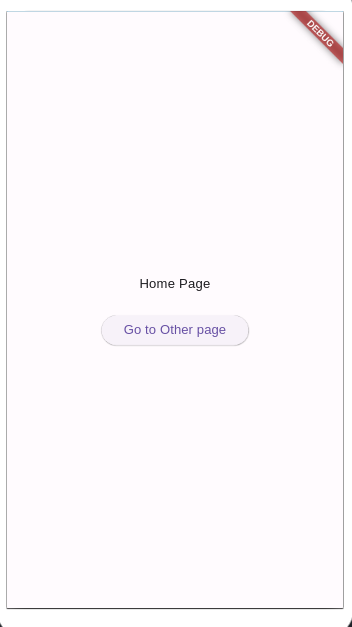
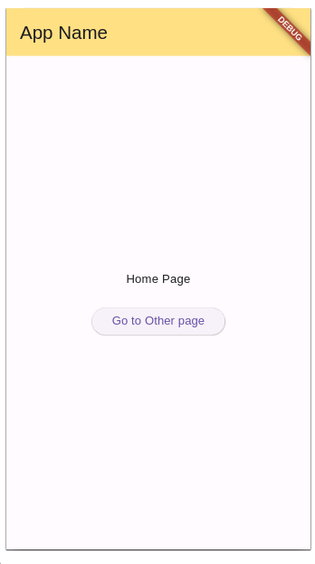
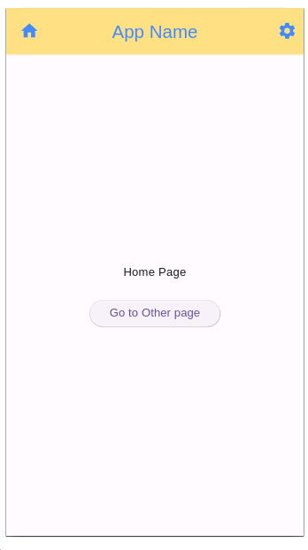
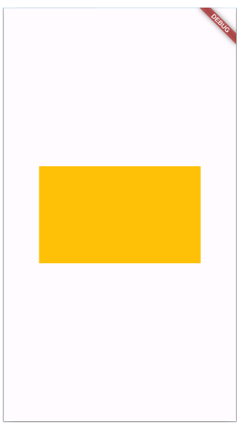
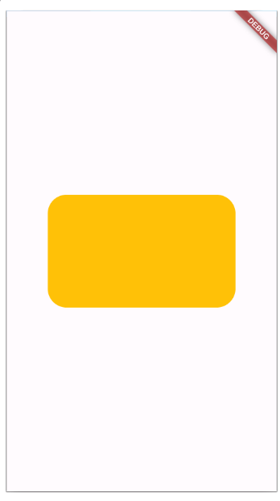
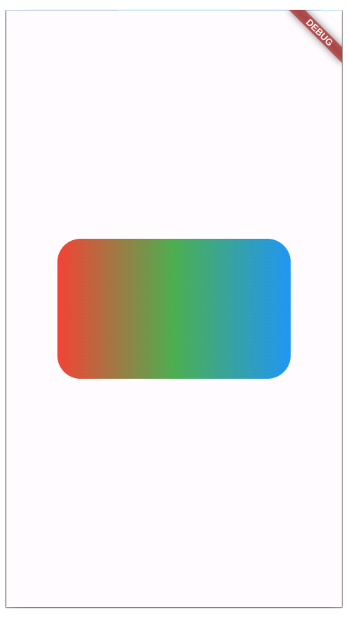

## ნავიგაცია Flutter_ში
სანამ ნავიგაციის ფუნქციონალს განვიხილავდეთ, რათქმაუნდა დაგვჭირდება ერთზე მეტი გვერდი ჩვენს აპლიკაციაში. ამიტომ პირველ რიგში მოდით შევქმნათ შესაბამისი ფაილები და ვიჯეტები:

ჩვენ პროექტში გვექნება სამი ფაილი: main.dart, home_page.dart და other_page.dart ფაილი. რა თქმა უნდა აუცილებელი არ არის, თუმცა კარგი იქნება თუკი ვიჯეტების ფაილებს, რომლებიც აპლიკაციის გვერდებს აღწერენ ცალკე ფოლდერში მოვათავსებთ. ამისთვის lib ფოლდერში დავამატებთ screens ფოლდერს შემდეგ კი შევქმნით home_page.dart და other_page.dart ფაილებს. აპლიკაციის საწყისი კოდი საბოლოო ჯამში ასე გამოიყურება:

### main.dart
```dart
import 'package:flutter/material.dart';
import 'package:navigation/screens/home_page.dart';

void main() => runApp(MyApp());

class MyApp extends StatelessWidget {
  const MyApp({super.key});
  @override
  Widget build(BuildContext context) {
    return MaterialApp(
      home: HomePage(),
    );
  }
}

```
### home_page.dart
```dart
import 'package:flutter/material.dart';

class HomePage extends StatelessWidget {
  const HomePage({Key? key}) : super(key: key);

  @override
  Widget build(BuildContext context) {
    return Scaffold();
  }
}

```


### other_page.dart
```dart
import 'package:flutter/material.dart';

class OtherPage extends StatelessWidget {
  const OtherPage({ Key? key }) : super(key: key);

  @override
  Widget build(BuildContext context) {
    return Scaffold();
  }
}

```

ამ მაგალითში გვინდა რომ HomePage ვიჯეტიდან შევძლოთ OtherPage ვიჯეტზე ნავიგაცია. ამიტომ მოდით HomePage_ში დავამატოთ ღილაკის ვიჯეტი, რომელზე დაჭერისასაც გაიხნსება OtherPage ეკრანი. ამის შემდეგ ჩვენი HomePage ვიჯეტის კოდი ასე გამოიყურება:

```dart
import 'package:flutter/material.dart';

class HomePage extends StatelessWidget {
  const HomePage({Key? key}) : super(key: key);

  @override
  Widget build(BuildContext context) {
    return Scaffold(
      body: Center(
        child: Column(
          mainAxisAlignment: MainAxisAlignment.center,
          children: [
            Text('Home Page'),
            SizedBox(
              height: 24,
            ),
            ElevatedButton(
              onPressed: () {},
              child: Text('Go to Other page'),
            ),
          ],
        ),
      ),
    );
  }
}


```

ხოლო HomePage ვიჯეტის ვიზუალი ასე:



ახლა მოდით ElevetedButton ვიჯეტზე დაჭერისას მომხმარებელი გადავიყვანოთ OtherPage ვიჯეტზე. ამისთვის onPressed პარამეტრის ფუნქციაში გამოვიყენებთ Navigator ობიექტის push მეთოდს. push მეთოდს ორი პარამეტრი გადაეცემა: BuildContext და MaterialPageRoute მონაცემის ტიპის ობიექტები.
- context ობიექტი რომელიც Flutter მა build მეთოდის გამოძახებისას გადმოგვაწოდა, შეიცავს აპლიკაციასთან დაკავშირებულ ინფორმაციას (მაგალითად რომელი გვერდია დახატული ეკრანზე ამ მომენტში)
- MaterialPageRoute ობიექტი აღწერს გზას რომელიც ჩვენმა აპლიკაციამ უნდა გაიაროს ერთი გვერდიდან მეორეზე ნავიგაციისას.

თავის მხრივ MaterialPageRoute ობიექტი პარამეტრის სახით (რომლის სახელი გახლავთ builder) ელოდება ფუნქციას. ამ ფუნქციამ უნდა დააბრუნოს ის ვიჯეტი, რომელიც ნავიგაციის შემდეგ უნდა დაიხატოს ეკრანზე. ამ ცვლილების შეტანის შემდეგ HomePage ვიჯეტის კოდი ასე გამოიყურება:

```dart
import 'package:flutter/material.dart';
import 'package:navigation/screens/other_page.dart';

class HomePage extends StatelessWidget {
  const HomePage({Key? key}) : super(key: key);

  @override
  Widget build(BuildContext context) {
    return Scaffold(
      body: Center(
        child: Column(
          mainAxisAlignment: MainAxisAlignment.center,
          children: [
            Text('Home Page'),
            SizedBox(
              height: 24,
            ),
            ElevatedButton(
              onPressed: () {
                Navigator.push(context, MaterialPageRoute(
                  builder: (context) {
                    return OtherPage();
                  },
                ));
              },
              child: Text('Go to Other page'),
            ),
          ],
        ),
      ),
    );
  }
}

```

თუ აპლიკაციას ემულატორზე გავუშვებთ აღმოვაჩენთ, რომ ღილაკზე დაჭერისას მართლაც გაიხნსება ჩვენი OtherPage გვერდი. ახლა კი მოდით OtherPage ვიჯეტში დავამატოთ უკან გამოსვლის ფუნქციონალი. 

```dart
import 'package:flutter/material.dart';

class OtherPage extends StatelessWidget {
  const OtherPage({Key? key}) : super(key: key);

  @override
  Widget build(BuildContext context) {
    return Scaffold(
      body: Center(
        child: Column(
          mainAxisAlignment: MainAxisAlignment.center,
          children: [
            Text('Other Page'),
            TextButton(
              onPressed: () {
                Navigator.pop(context);
              },
              child: Text('Go Back'),
            )
          ],
        ),
      ),
    );
  }
}


```

როგორც ხედავთ უკან დასაბრუნებლადაც ჩვენ Navigator კლასს ვიყენებთ. pop ფუნქციას კი ერთადერთი პარამეტრი სჭირდება - კონტექსტი.


## AppBar ვიჯეტი და მისი პარამეტრები
ხშირად აპლიკაციებში შევხვდებით ხოლმე სათაურის ზოლს, სადაც აპლიკაციის ან გვერდის სათაურთან ერთად სხვადასხვა ფუნქციონალის ღილაკები გვაქვს მოცემული. მსგავს კომპონენტს Flutter_ში AppBar ვიჯეტის დახმარებით შევქმნით. მოდით ვნახოთ AppBar ვიჯეტის მარტივი მაგალითი HomePage გვერდზე.

```dart
import 'package:flutter/material.dart';
import 'package:navigation/screens/other_page.dart';

class HomePage extends StatelessWidget {
  const HomePage({Key? key}) : super(key: key);

  @override
  Widget build(BuildContext context) {
    return Scaffold(
      appBar: AppBar(
        title: Text('App Name'),
        backgroundColor: Colors.amber[200],
      ),
      body: Center(
        child: Column(
          mainAxisAlignment: MainAxisAlignment.center,
          children: [
            Text('Home Page'),
            SizedBox(
              height: 24,
            ),
            ElevatedButton(
              onPressed: () {
                Navigator.push(
                  context,
                  MaterialPageRoute(
                    builder: (context) {
                      return OtherPage();
                    },
                  ),
                );
              },
              child: Text('Go to Other page'),
            ),
          ],
        ),
      ),
    );
  }
}

```

ყურადღება მიაქციე, რომ AppBar ვიჯეტი არ დაგვიმატებია Scaffold ვიჯეტის body პარამეტრში. არამედ ჩვენ ის Scaffold ვიჯეტის appBar პარამეტრში შევიტანეთ.
Flutter_ის ბოლო ვერსიაში, რომელსაც ჩვენ ვიყენებთ, default_ად AppBar ვიჯეტი არის თეთრი, ამიტომ გადავაწოდეთ backgroundColor პარამეტრი რათა უკეთ დავინახოთ AppBar ვიჯეტი ვიზუალურად. მეორე პარამეტი კი რომელიც AppBar ვიჯეტს გავუწერეთ გახლავთ title. title პარამეტრს Text ვიჯეტი გადავეცით მნიშვნელობად. ამის შემდეგ ჩვენი აპლიკაციის HomePage გვერდი ასე გამოიყურება:



მოდით AppBar ვიჯეტის კიდევ რამდენიმე მარტივი პარამეტრი ვისწავლოთ:

```dart
import 'package:flutter/material.dart';
import 'package:navigation/screens/other_page.dart';

class HomePage extends StatelessWidget {
  const HomePage({Key? key}) : super(key: key);

  @override
  Widget build(BuildContext context) {
    return Scaffold(
      appBar: AppBar(
        title: Text('App Name'),
        backgroundColor: Colors.amber[200],
        leading: Icon(Icons.home),
        centerTitle: true,
        actions: [
          IconButton(onPressed: () {}, icon: Icon(Icons.settings)),
        ],
        foregroundColor: Colors.blueAccent,
      ),
      body: Center(
        child: Column(
          mainAxisAlignment: MainAxisAlignment.center,
          children: [
            Text('Home Page'),
            SizedBox(
              height: 24,
            ),
            ElevatedButton(
              onPressed: () {
                Navigator.push(
                  context,
                  MaterialPageRoute(
                    builder: (context) {
                      return OtherPage();
                    },
                  ),
                );
              },
              child: Text('Go to Other page'),
            ),
          ],
        ),
      ),
    );
  }
}

```

მოდით განვიხილოთ დამატებული პარამეტრები:
- leading - როგორც წესი ვიყენებთ აპლიკაციის ლოგოსთვის
- centerTitle - თუ კი გადავცემთ მნიშვნელობას true აპლიკაციის title პარამეტრი გაიცენტრება ჰორიზონტალურად.
- actions - მნიშნველობად იღებს სიას, რომლის ელემენტებიც როგორც წესი იქნება ღილაკი(ები) სხვადასხვა აპლიკაციის მნიშვნელოვანი ფუნქციონალით
- foregroundColor - AppBar ვიჯეტის ყველა ელემენტის ფერის შესაცვლელად.

!!! debug 'ლენტის' დასამალად MaterialApp ვიჯეტს გადავაწოდეთ debugShowCheckedModeBanner პარამეტრი false მნიშვნელობით:

```dart
import 'package:flutter/material.dart';
import 'package:navigation/screens/home_page.dart';

void main() => runApp(MyApp());

class MyApp extends StatelessWidget {
  const MyApp({super.key});
  @override
  Widget build(BuildContext context) {
    return MaterialApp(
      debugShowCheckedModeBanner: false,
      home: HomePage(),
    );
  }
}

```

ამ ცვლილებების შემდეგ ჩვენი HomePage ვიჯეტი ასე გამოიყურება:



ახლა მოდით AppBar ვიჯეტის კიდევ ერთი მნიშვნელოვანი ფუნქციონალი ვნახოთ. ამისთვის OtherPage ვიჯეტში დავამატოთ ცარიელი AppBar ვიჯეტი:

```dart

import 'package:flutter/material.dart';

class OtherPage extends StatelessWidget {
  const OtherPage({Key? key}) : super(key: key);

  @override
  Widget build(BuildContext context) {
    return Scaffold(
      appBar: AppBar(),
      body: Center(
        child: Column(
          mainAxisAlignment: MainAxisAlignment.center,
          children: [
            Text('Other Page'),
            TextButton(
              onPressed: () {
                Navigator.pop(context);
              },
              child: Text('Go Back'),
            )
          ],
        ),
      ),
    );
  }
}

```

ამის შემდეგ OtherPage გვერდზე AppBar ვიჯეტის მარცხენა მხარეს გამოჩნდება უკან გამოსვლის ღილაკი, მასზე დაჭერისას კი რათქმაუნდა გამოვალთ წინა გვერდზე.

## Container ვიჯეტის decoration პარამეტრი

ახლა ჩვენ შევისწავლით Container ვიჯეტის ახალ პარამეტრს - decoration. ამისთვის ჩვენ ახალ მარტივ პროექტს შევქმნით.

```dart
import 'package:flutter/material.dart';

void main() {
  runApp(MyApp());
}

class MyApp extends StatelessWidget {
  @override
  Widget build(BuildContext context) {
    return MaterialApp(
      home: Scaffold(
        body: Center(
          child: Container(
            color: Colors.amber,
            width: 250,
            height: 150,
          ),
        ),
      ),
    );
  }
}

```

როგორც ხედავთ შევქმენით მარტივი აპლიკაცია სადაც ეკრანის ცენტრში მოცემული გვაქვს ყვითელი მართკუთხედი:



ახლა მოდით Container ვიჯეტს დავამატოთ decoration პარამეტრი და მნიშვნელობად გადავცეთ BoxDecoration ობიექტი:

```dart
import 'package:flutter/material.dart';

void main() {
  runApp(MyApp());
}

class MyApp extends StatelessWidget {
  @override
  Widget build(BuildContext context) {
    return MaterialApp(
      home: Scaffold(
        body: Center(
          child: Container(
            color: Colors.amber,
            width: 250,
            height: 150,
            decoration: BoxDecoration(),
          ),
        ),
      ),
    );
  }
}

```

ამის შემდეგ ჩვენი აპლიკაცია ამოგვიგდებს ერორ მესიჯს, რომელიც გვამცნობს, რომ არ შეიძლება Container ვიჯეტს ქონდეს color და decoration პარამეტრი ერთ დროულად. ამ პრობლემის გადაჭრა მარტივია, შეგვიძლია color პარამეტრი პირდაპირ გადავიტანოთ BoxDecoration ობიექტის პარამეტრად.


```dart
import 'package:flutter/material.dart';

void main() {
  runApp(MyApp());
}

class MyApp extends StatelessWidget {
  @override
  Widget build(BuildContext context) {
    return MaterialApp(
      home: Scaffold(
        body: Center(
          child: Container(
            width: 250,
            height: 150,
            decoration: BoxDecoration(
              color: Colors.amber,
            ),
          ),
        ),
      ),
    );
  }
}


```

ამის შემდეგ ჩვენი ყვითელი მართკუთხედი კვლავ დაბრუნდება ეკრანზე. ახლა მოდით ვნახოთ, როგორ შეგვიძლია ჩვენს მართკუთხედს მოვუმრგვალოდ კუთხეები:

```dart
import 'package:flutter/material.dart';

void main() {
  runApp(MyApp());
}

class MyApp extends StatelessWidget {
  @override
  Widget build(BuildContext context) {
    return MaterialApp(
      home: Scaffold(
        body: Center(
          child: Container(
            width: 250,
            height: 150,
            decoration: BoxDecoration(
              color: Colors.amber,
              borderRadius: BorderRadius.circular(25),
            ),
          ),
        ),
      ),
    );
  }
}

```

borderRadius პარამეტრის გაწერის შემდეგ ჩვენი მართკუთხედი ასე გამოიყურება:



ასევე მარტივად შეგვიძლია Conainer ვიჯეტის უკანა ფონად გვქონდეს გრადიენტი (ფერთა გადასვლა) ამისთვის გამოვიყენებთ Container ვიჯეტის gradient პარამეტრს:

```dart
import 'package:flutter/material.dart';

void main() {
  runApp(MyApp());
}

class MyApp extends StatelessWidget {
  @override
  Widget build(BuildContext context) {
    return MaterialApp(
      home: Scaffold(
        body: Center(
          child: Container(
            width: 250,
            height: 150,
            decoration: BoxDecoration(
              color: Colors.amber,
              borderRadius: BorderRadius.circular(25),
              gradient: LinearGradient(
                colors: [
                  Colors.red,
                  Colors.green,
                  Colors.blue,
                ],
              ),
            ),
          ),
        ),
      ),
    );
  }
}

```

gradient პარამეტრს მნიშვნელობად გადავეცით LinearGradient ობიექტი, რომელსაც ერთი აუცილებელი პარამეტრი colors აქვს. colors პარამეტრს კი მნიშვნელობად სჭირდება სია რომელიც 2 ან მეტ ფერს შეიცავს. ამ ცვლილების შემდეგ ჩვენი აპლიკაცია ასე გამოიყურება:



LinearGradient ობიექტის გარდა gradient პარამეტრს შეგვიძლია გადავცეთ RadialGradient ობიექტი, რომელშიც წრიული ფერთა გადასვლა გვექნება.

## GestureDetector ვიჯეტი

მობილურ აპლიკაციებში ხშირად გვხდება შემთხვევა, როდესაც გვინდა რომელიმე ვიჯეტს მივანიჭოთ მომხმარებლის ინტერაქციის დაფიქსირების უნარი. (მაგალითად ვიჯეტზე დაჭერისას შევასრულოთ რაიმე ფუნქციონალი). ამისთვის Flutter_ის ნებისმიერი ვიზუალური ვიჯეტი შეგვიძლია ჩავსვათ GestureDetector ვიჯეტში. GestureDetector ვიჯეტს გააჩნია უამრავი პარამეტრი, რომლის დახმარებით შეგვიძლია მომხმარებლის სხვადსხვა ინტერაქცია დავაფიქსიროთ.

```dart
import 'package:flutter/material.dart';

void main() {
  runApp(MyApp());
}

class MyApp extends StatelessWidget {
  @override
  Widget build(BuildContext context) {
    return MaterialApp(
      home: Scaffold(
        body: Center(
          child: GestureDetector(
            onTap: () {},
            onDoubleTap: () {},
            onLongPress: () {},
            child: Container(
              width: 250,
              height: 150,
              decoration: BoxDecoration(
                color: Colors.amber,
                borderRadius: BorderRadius.circular(25),
                gradient: LinearGradient(
                  colors: [
                    Colors.red,
                    Colors.green,
                    Colors.blue,
                  ],
                ),
              ),
            ),
          ),
        ),
      ),
    );
  }
}
```

მოცემულ მაგალითში Container ვიჯეტი ჩავსვით GestureDetector ვიჯეტში. ამის შემდეგ კი გადავეცით სამი პარამეტრი
- onTap - პარამეტრში გადაცემული ფუნქცია შესრულდება ვიჯეტზე თითის მცირე ხნით დადებისას
- onDoubleTap - პარამეტრში გადაცემული ფუნქცია შესრულდება ვიჯეტზე თითის ორჯერ დადებისას
- onLongPress - პარამეტრში გადაცემული ფუნქცია შესრულდება ვიჯეტზე თითის დიდხანს დადებისას

GestureDetector ბევრი სხვა ინტერაქციის დაფიქსირება შეუძლია, თუმცა ჯერჯერობით ეს სამი პარამეტრი ჩვენთვის სრულიად საკმარისი იქნება.