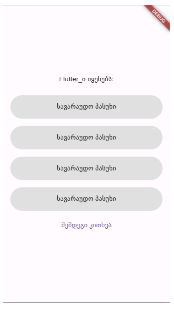
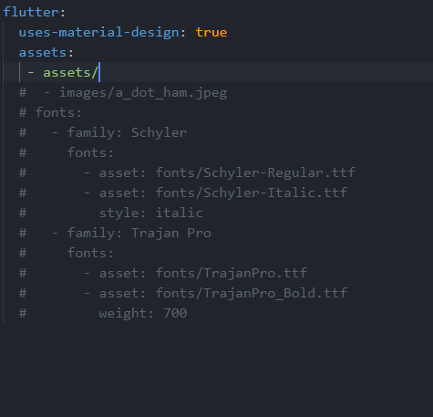

## საწყისი კოდი
როგორც უკვე იცით ამ გაკვეთილში მარტივი ქვიზის აპლიკაციას შევქმნით. ჩვენი აპლიკაციის საწყისი კოდი ასე გამოიყურება:

### main.dart

```dart

import 'package:flutter/material.dart';
import 'package:quiz/screens/quiz.dart';

void main() {
  runApp(MyApp());
}

class MyApp extends StatelessWidget {
  const MyApp({super.key});
  @override
  Widget build(BuildContext context) {
    return MaterialApp(
      home: QuizPage(),
    );
  }
}

```

### quiz.dart

```dart
import 'package:flutter/material.dart';

class QuizPage extends StatefulWidget {
  const QuizPage({Key? key}) : super(key: key);

  @override
  State<QuizPage> createState() => _QuizPageState();
}

class _QuizPageState extends State<QuizPage> {
  @override
  Widget build(BuildContext context) {
    return const Placeholder();
  }
}

```

!!! quiz.dart ფაილი დავამატეთ ახალ screens ფოლდერში რომელიც თავის მხრივ lib ფოლდერშია მოთავსებული

ახლა კი ჩვენს აპლიკაციაში მოდით აღვწეროთ 'კითხვის' ობიექტი, კლასის დახმარებით. პირველ რიგში დავამატოთ ახალი ფოლდერი სახელად data და მასში შევქმნათ ფაილი question.dart. Question კლასი ასე გამოიყურება:


```dart
class Question {
  Question({
    required this.question,
    required this.answers,
    required this.correctAnswer,
  });

  final String question;
  final List<String> answers;
  final String correctAnswer;
}


```

ამ ფაილში აღწერილი ცვლადები:
- question - გამოვიყენებთ ქვიზის ერთი კითხვის შესანახად
- answers - გამოვიყენებთ ქვიზის ერთი კითხვის სავარაუდო პასუხების შესანახად
- correctAnswer - გამოვიყენებთ ქვიზის ერთი კითხვის სწორი პასუხის შესანახად

ახლა კი მოდით შევქმნათ ჩვენი ქვიზის გვერდის საწყისი ვიზუალური ნაწილი. ჯერჯერობით დავამატებთ მხოლოდ ერთ ცალ Text ვიჯეტს ქვიზის კითხვების გამოსაჩენად და TextButton ვიჯეტს შემდეგ კითხვაზე გადასვლისათვის.

ამ ცვლილებების შეტანის შემდეგ ჩვენი აპლიკაციის კოდი ასე გამოიყურება:

```dart
import 'package:flutter/material.dart';

class QuizPage extends StatefulWidget {
  const QuizPage({Key? key}) : super(key: key);

  @override
  State<QuizPage> createState() => _QuizPageState();
}

class _QuizPageState extends State<QuizPage> {
  @override
  Widget build(BuildContext context) {
    return Scaffold(
      body: Center(
        child: Column(
          mainAxisAlignment: MainAxisAlignment.center,
          children: [
            Text('კითხვა'),
            TextButton(onPressed: () {}, child: Text('შემდეგი კითხვა'))
          ],
        ),
      ),
    );
  }
}

```

ხოლო აპლიკაციის ვიზუალი კი ასე:


მოდით question.dart ფაილში დავამატოთ ცვლადი რომელიც შეინახავს რამდენიმე სატესტო კითხვას ჩვენი აპლიკაციისათვის:

### question.dart

```dart
class Question {
  Question({
    required this.question,
    required this.answers,
    required this.correctAnswer,
  });

  final String question;
  final List<String> answers;
  final String correctAnswer;
}

List<Question> questions = [
  Question(
    question: 'Flutter_ი იყენებს:',
    answers: [
      'python',
      'java',
      'dart',
      'golang',
    ],
    correctAnswer: 'dart',
  ),
  Question(
    question: 'Flutter_ი შექმნილია:',
    answers: [
      'Amazon_ის მიერ',
      'Google_ის მიერ',
      'Facebook_ის მიერ',
      'Github_ის მიერ',
    ],
    correctAnswer: 'Google_ის მიერ',
  ),
  Question(
    question: 'Dart_ი არის',
    answers: [
      'ფრეიმვორკი',
      'ცხოველი',
      'პროგრამირების ენა',
      'კომპიუტერის ნაწილი',
    ],
    correctAnswer: 'პროგრამირების ენა',
  ),
  
];

```

როგორც ხედავთ question.dart ფაილში ახლა Question კლასთან ერთად გვაქვს ცვლადი სახელად questions, რომელშიც სამი ცალი სატესტო კითხვა შევიტანეთ. ამის შემდეგ მოდით ამ ცვლადიდან ჩვენს QuizPage ვიჯეტში.

### QuizPage ვიჯეტი

```dart
import 'package:flutter/material.dart';
import 'package:quiz/data/question.dart';

class QuizPage extends StatefulWidget {
  const QuizPage({Key? key}) : super(key: key);

  @override
  State<QuizPage> createState() => _QuizPageState();
}

class _QuizPageState extends State<QuizPage> {
  int index = 0;

  void nextQuestion() {
    setState(() {
      if (index < questions.length - 1) {
        index++;
      }
    });
  }

  @override
  Widget build(BuildContext context) {
    return Scaffold(
      body: Center(
        child: Column(
          mainAxisAlignment: MainAxisAlignment.center,
          children: [
            Text(questions[index].question),
            TextButton(
                onPressed: () {
                  nextQuestion();
                },
                child: Text('შემდეგი კითხვა'))
          ],
        ),
      ),
    );
  }
}

```

ამ ცვლილებებით:
- შევქმენით index ცვლადი, რათა ვაკონტროლოთ თუ მერამდენე კითხვას გამოვაჩენთ ჩვენს აპლიკაციაში
- კითხვისათვის განკუთვნილ Text ვიჯეტში questions ცვლადიდან ინდექსის დახმარებით მოგვაქვს ჩვენი პირველი კითხვა
- TextButton ვიჯეტის onPressed პარამეტრში ვიძახებთ nextQuestion ფუნქციას
- nextQuestion ფუნქციაში ვზრდით ინდექსს ერთით (რის შემდეგაც ჩვენი აპლიკაცია გადავა შემდეგ კითხვაზე) იმ შემთხვევაში თუ შემდეგი კითხვა არსებობს

ახლა კი მოდით შევქმნათ ვიჯეტი სავარაუდო პასუხებისათვის


### Answer ვიჯეტი

Answer ვიჯეტის კოდი საწყის ეტაპზე ასე გამოიყურება:

```dart
import 'package:flutter/material.dart';

class Answer extends StatelessWidget {
  const Answer({Key? key}) : super(key: key);

  @override
  Widget build(BuildContext context) {
    return Container(
      margin: EdgeInsets.only(bottom: 16),
      decoration: BoxDecoration(
        borderRadius: BorderRadius.circular(25),
        color: Colors.grey[300],
      ),
      width: double.infinity,
      height: 50,
      child: Center(
        child: Text('სავარაუდო პასუხი'),
      ),
    );
  }
}

```

QuizPage ვიჯეტში მოდით შევიტანოთ ოთხი ცალი Answer ვიჯეტი და ასევე დავამატოთ მარჯიები: 

```dart
import 'package:flutter/material.dart';
import 'package:quiz/components/answer.dart';
import 'package:quiz/data/question.dart';

class QuizPage extends StatefulWidget {
  const QuizPage({Key? key}) : super(key: key);

  @override
  State<QuizPage> createState() => _QuizPageState();
}

class _QuizPageState extends State<QuizPage> {
  int index = 0;

  void nextQuestion() {
    setState(() {
      if (index < questions.length - 1) {
        index++;
      }
    });
  }

  @override
  Widget build(BuildContext context) {
    return Scaffold(
      body: Center(
        child: Container(
          margin: EdgeInsets.symmetric(horizontal: 16),
          child: Column(
            mainAxisAlignment: MainAxisAlignment.center,
            children: [
              Text(questions[index].question),
              SizedBox(
                height: 24,
              ),
              Answer(),
              Answer(),
              Answer(),
              Answer(),
              TextButton(
                  onPressed: () {
                    nextQuestion();
                  },
                  child: Text('შემდეგი კითხვა'))
            ],
          ),
        ),
      ),
    );
  }
}


```

ამ ცვლილებების შემდეგ ჩვენი აპლიკაცია ასე გამოიყურება:



ახლა Answer ვიჯეტს რამდენიმე ფუნქციონალი გვინდა მივანიჭოთ:
1. უნდა გამოაჩინოს შესაბამისი კითხვის შესაბამისი სავარაუდო პასუხი
2. მომხმარებელს უნდა შეეძლოს ამ ვიჯეტზე 'დაჭერა'
3. დაჭერისას სწორი პასუხის შემთხვევაში ვიჯეტი უნდა გამწვანდეს, არასწორის - გაწითლდეს

ამ ცვლილებების შემდეგ ჩვენი Answer ვიჯეტის კოდი ასე გამოიყურება:

```dart
import 'package:flutter/material.dart';

class Answer extends StatelessWidget {
  const Answer({
    Key? key,
    required this.answer,
    required this.color,
  }) : super(key: key);

  final Color color;
  final String answer;

  @override
  Widget build(BuildContext context) {
    return GestureDetector(
      onTap: () {},
      child: Container(
        margin: EdgeInsets.only(bottom: 16),
        decoration: BoxDecoration(
          borderRadius: BorderRadius.circular(25),
          color: color,
        ),
        width: double.infinity,
        height: 50,
        child: Center(
          child: Text(answer),
        ),
      ),
    );
  }
}

```

როგორც ხედავთ ვიჯეტის შექმნისას კონსტრუქტორში ვითხოვთ ფერს და სავარაუდო პასუხს შემდეგ კი ამ ინფორმაციებს შესაბამის ვიჯეტებში გამოვსახავთ. დამატებით მთლიანი ვიჯეტი ჩავსვით GestureDetector ვიჯეტში და შემოვიტანეთ onTap პარამეტრი, რომელიც ჯერჯერობით ცარიელია. ამის შემდეგ რათქმაუნდა QuizPage ვიჯეტში ეს ინფორმაციები უნდა გადმოვაწოდოთ Answer ვიჯეტს:

```dart
import 'package:flutter/material.dart';
import 'package:quiz/components/answer.dart';
import 'package:quiz/data/question.dart';

class QuizPage extends StatefulWidget {
  const QuizPage({Key? key}) : super(key: key);

  @override
  State<QuizPage> createState() => _QuizPageState();
}

class _QuizPageState extends State<QuizPage> {
  int index = 0;
  List<Color> colors = [
    Colors.grey.shade300,
    Colors.grey.shade300,
    Colors.grey.shade300,
    Colors.grey.shade300,
  ];

  void nextQuestion() {
    setState(() {
      if (index < questions.length - 1) {
        index++;
      }
    });
  }

  @override
  Widget build(BuildContext context) {
    return Scaffold(
      body: Center(
        child: Container(
          margin: EdgeInsets.symmetric(horizontal: 16),
          child: Column(
            mainAxisAlignment: MainAxisAlignment.center,
            children: [
              Text(questions[index].question),
              SizedBox(
                height: 24,
              ),
              Answer(
                color: colors[0],
                answer: questions[index].answers[0],
              ),
              Answer(
                color: colors[1],
                answer: questions[index].answers[1],
              ),
              Answer(
                color: colors[2],
                answer: questions[index].answers[2],
              ),
              Answer(
                color: colors[3],
                answer: questions[index].answers[3],
              ),
              TextButton(
                  onPressed: () {
                    nextQuestion();
                  },
                  child: Text('შემდეგი კითხვა'))
            ],
          ),
        ),
      ),
    );
  }
}

```

Answer ვიჯეტი სწორად გამოსახავს შესაბამის სავარაუდო პასუხს, თუმცა მომხმარებელს არ შეუძლია აირჩიოს მისთვის სასურველი პასუხი. მოდით სწორედ ამ ფუნქციონალზე ვიზრუნოთ
პირველ რიგში QuizPage ვიჯეტში დავამატოთ ფუნქცია სახელად checkAnswer, რომელსაც Answer ვიჯეტი გამოიძახებს მასზე დაჭერისას. checkAnswer ვიჯეტს ასევე დასჭირდება პარამეტრი რათა შეძლოს გაიგოს თუ რომელმა Answer ვიჯეტმა გამოიძახა. ამისთვის Anaswer ვიჯეტს შექმნისას ჯერ გადავცემთ რაიმე მნიშვნელობას რიგითობის აღსანიშნავად, შემდეგ კი Answer ვიჯეტზე დაჭერისას checkAnswer ფუნქციას სწორედ ამ მნიშვნელობას გადმოსცემს. 

ამ ცვლილებების შემდეგ Answer ვიჯეტი ასე გამოიყურება:

```dart
import 'package:flutter/material.dart';

class Answer extends StatelessWidget {
  const Answer(
      {Key? key,
      required this.answer,
      required this.color,
      required this.order,
      required this.checkAnswer})
      : super(key: key);

  final Color color;
  final String answer;
  final int order;
  final Function(int order) checkAnswer;

  @override
  Widget build(BuildContext context) {
    return GestureDetector(
      onTap: () {
        checkAnswer(order);
      },
      child: Container(
        margin: EdgeInsets.only(bottom: 16),
        decoration: BoxDecoration(
          borderRadius: BorderRadius.circular(25),
          color: color,
        ),
        width: double.infinity,
        height: 50,
        child: Center(
          child: Text(answer),
        ),
      ),
    );
  }
}

```

როგორც ხედავ შევქმენით ორი ახალი ცვლადი:
1. order - რომელსაც რიგითობის აღსანიშნავად ვიყენებთ
2. checkAnswer - ფუნქცია რომელსაც ვიძახებთ Answer ვიჯეტზე დაჭერისას და ვაწვდით order მნიშვნელობას

ხოლო QuizPage ვიჯეტი ასე გამოიყურება:

```dart
import 'package:flutter/material.dart';
import 'package:quiz/components/answer.dart';
import 'package:quiz/data/question.dart';

class QuizPage extends StatefulWidget {
  const QuizPage({Key? key}) : super(key: key);

  @override
  State<QuizPage> createState() => _QuizPageState();
}

class _QuizPageState extends State<QuizPage> {
  int index = 0;
  List<Color> colors = [
    Colors.grey.shade300,
    Colors.grey.shade300,
    Colors.grey.shade300,
    Colors.grey.shade300,
  ];

  void nextQuestion() {
    setState(() {
      if (index < questions.length - 1) {
        index++;
      }
    });
  }

  void checkAnswer(int order) { }

  @override
  Widget build(BuildContext context) {
    return Scaffold(
      body: Center(
        child: Container(
          margin: EdgeInsets.symmetric(horizontal: 16),
          child: Column(
            mainAxisAlignment: MainAxisAlignment.center,
            children: [
              Text(questions[index].question),
              SizedBox(
                height: 24,
              ),
              Answer(
                color: colors[0],
                answer: questions[index].answers[0],
                order: 0,
                checkAnswer: checkAnswer,
              ),
              Answer(
                color: colors[1],
                answer: questions[index].answers[1],
                order: 1,
                checkAnswer: checkAnswer,
              ),
              Answer(
                color: colors[2],
                answer: questions[index].answers[2],
                order: 2,
                checkAnswer: checkAnswer,
              ),
              Answer(
                color: colors[3],
                answer: questions[index].answers[3],
                order: 3,
                checkAnswer: checkAnswer,
              ),
              TextButton(
                  onPressed: () {
                    nextQuestion();
                  },
                  child: Text('შემდეგი კითხვა'))
            ],
          ),
        ),
      ),
    );
  }
}


```

აქ გვაქვს რამდენიმე ცვლილება:
- პირველ რიგში აღვწერეთ checkAnswer ფუნქცია (რომელიც ჯერჯერობით ცარიელია)
- და ასევე Answer ვიჯეტებს გადავაწოდეთ შესაბამისი მნიშვნელობები

ახლა კი მოდით checkAnswer ფუნქციას მივხედოთ:

```dart
  void checkAnswer(int order) {
    setState(() {
      if (questions[index].correctAnswer == questions[index].answers[order]) {
        colors[order] = Colors.green;
      } else {
        colors[order] = Colors.red;
      }
    });
  }
```

როგორც ხედავ მოცემულ ფუნქციაში ვამოწმებთ თუ კი შესაბამისი კითხვის სწორი პასუხი შეესაბამება მომხმარებლის მიერ არჩეულ Answer ვიჯეტში მოცემულ პასუხს. ამის შემდეგ კი ვამწვანებთ ან ვაწითლებთ შესაბამის Answer ვიჯეტს.

იმის მიუხედავად რომ ჩვენი აპლიკაცია ასე თუ ისე ასრულებს სასურველ ფუნქციონალს გვაქვს რამდენიმე პრობლემა:
1. შემდეგ კითხვაზე გადასვლისას ღილაკების ფერები არ უბრუნდება default მნიშვნელობებს
2. მომხმარებელს შეუძლია ერთზე მეტი პასუხი აირჩიოს
3. არსად არ ვითვლით სწორი პასუხების რაოდენობას
4. კითხვების ამოწურვის შემდეგ ჩვენს აპლიკაციაში არაფერი არ ხდება

პირველი პრობლემის მოგვარება ძალიან მარტივია, nextQuestion ფუნქციაში colors ცვლადში შევინახოთ ღილაკების default ფერის მნიშვნელობები:

```dart
void nextQuestion() {
    setState(() {
      if (index < questions.length - 1) {
        index++;
      }

      colors = [
        Colors.grey.shade300,
        Colors.grey.shade300,
        Colors.grey.shade300,
        Colors.grey.shade300,
      ];
    });
  }
```


მეორე პრობლემის მოგვარებაც მარტივია, შევქმნათ bool ტიპის ცვლადი სახელად alreadyAnswered, default მნიშვნელობით false. როგორც კი მომხმარებელი აირჩევს რომელიმე პასუხს alreadyAnswered ცვლადის მნიშვნელობა გახდება true. თუკი მომხმარებელს უკვე არჩეული აქვს პასუხი სხვა პასუხის არჩევის უფლებას არ მივცემთ სანამ არ გადავა ის შემდეგ კითხვაზე.

```dart
import 'package:flutter/material.dart';
import 'package:quiz/components/answer.dart';
import 'package:quiz/data/question.dart';

class QuizPage extends StatefulWidget {
  const QuizPage({Key? key}) : super(key: key);

  @override
  State<QuizPage> createState() => _QuizPageState();
}

class _QuizPageState extends State<QuizPage> {
  int index = 0;
  List<Color> colors = [
    Colors.grey.shade300,
    Colors.grey.shade300,
    Colors.grey.shade300,
    Colors.grey.shade300,
  ];
  bool alreadyAnswered = false;

  void nextQuestion() {
    setState(() {
      if (index < questions.length - 1) {
        index++;
      }
      alreadyAnswered = false;

      colors = [
        Colors.grey.shade300,
        Colors.grey.shade300,
        Colors.grey.shade300,
        Colors.grey.shade300,
      ];
    });
  }

  void checkAnswer(int order) {
    setState(() {
      if (!alreadyAnswered) {
        if (questions[index].correctAnswer == questions[index].answers[order]) {
          colors[order] = Colors.green;
        } else {
          colors[order] = Colors.red;
        }
        alreadyAnswered = true;
      }
    });
  }

  @override
  Widget build(BuildContext context) {
    return Scaffold(
      body: Center(
        child: Container(
          margin: EdgeInsets.symmetric(horizontal: 16),
          child: Column(
            mainAxisAlignment: MainAxisAlignment.center,
            children: [
              Text(questions[index].question),
              SizedBox(
                height: 24,
              ),
              Answer(
                color: colors[0],
                answer: questions[index].answers[0],
                order: 0,
                checkAnswer: checkAnswer,
              ),
              Answer(
                color: colors[1],
                answer: questions[index].answers[1],
                order: 1,
                checkAnswer: checkAnswer,
              ),
              Answer(
                color: colors[2],
                answer: questions[index].answers[2],
                order: 2,
                checkAnswer: checkAnswer,
              ),
              Answer(
                color: colors[3],
                answer: questions[index].answers[3],
                order: 3,
                checkAnswer: checkAnswer,
              ),
              TextButton(
                  onPressed: () {
                    nextQuestion();
                  },
                  child: Text('შემდეგი კითხვა'))
            ],
          ),
        ),
      ),
    );
  }
}

```

ახლა მოდით დავითვალოთ მომხმარებლის მიერ სწორად გაცემული პასუხების რაოდენობა. ამისთვის დავამტოთ points ცვლადი და ასევე Text ვიჯეტი. როდესაც მომხარებელი სწორ პასუხს აირჩევს checkAnswer ფუნქციაში გავზარდოთ points ცვლადის მნიშვნელობა.

```dart
import 'package:flutter/material.dart';
import 'package:quiz/components/answer.dart';
import 'package:quiz/data/question.dart';

class QuizPage extends StatefulWidget {
  const QuizPage({Key? key}) : super(key: key);

  @override
  State<QuizPage> createState() => _QuizPageState();
}

class _QuizPageState extends State<QuizPage> {
  int index = 0;
  List<Color> colors = [
    Colors.grey.shade300,
    Colors.grey.shade300,
    Colors.grey.shade300,
    Colors.grey.shade300,
  ];
  bool alreadyAnswered = false;
  int points = 0;

  void nextQuestion() {
    setState(() {
      if (index < questions.length - 1) {
        index++;
      }
      alreadyAnswered = false;

      colors = [
        Colors.grey.shade300,
        Colors.grey.shade300,
        Colors.grey.shade300,
        Colors.grey.shade300,
      ];
    });
  }

  void checkAnswer(int order) {
    setState(() {
      if (!alreadyAnswered) {
        if (questions[index].correctAnswer == questions[index].answers[order]) {
          colors[order] = Colors.green;
          points++;
        } else {
          colors[order] = Colors.red;
        }
        alreadyAnswered = true;
      }
    });
  }

  @override
  Widget build(BuildContext context) {
    return Scaffold(
      body: Center(
        child: Container(
          margin: EdgeInsets.symmetric(horizontal: 16),
          child: Column(
            mainAxisAlignment: MainAxisAlignment.center,
            children: [
              Text('points: $points'),
              SizedBox(
                height: 16,
              ),
              Text(questions[index].question),
              SizedBox(
                height: 24,
              ),
              Answer(
                color: colors[0],
                answer: questions[index].answers[0],
                order: 0,
                checkAnswer: checkAnswer,
              ),
              Answer(
                color: colors[1],
                answer: questions[index].answers[1],
                order: 1,
                checkAnswer: checkAnswer,
              ),
              Answer(
                color: colors[2],
                answer: questions[index].answers[2],
                order: 2,
                checkAnswer: checkAnswer,
              ),
              Answer(
                color: colors[3],
                answer: questions[index].answers[3],
                order: 3,
                checkAnswer: checkAnswer,
              ),
              TextButton(
                  onPressed: () {
                    nextQuestion();
                  },
                  child: Text('შემდეგი კითხვა'))
            ],
          ),
        ),
      ),
    );
  }
}


```


სულ ბოლოს მოდით კითხვების ამოწურვის შემდეგ გადავიყვანოთ მომხმარებელი რეზულტატების ეკრანზე.

- პირველრიგში შევქმნათ ახალი ეკრანი.
- კონსტრუქტორში მოვითხოვოთ სწორი პასუხების რაოდენობა.
- კითხვების ამოწურვის შემდეგ გადავიდეთ ამ ეკრანზე.

result.dart ფაილი ასე გამოიყურება:

```dart
import 'package:flutter/material.dart';

class ResultScreen extends StatelessWidget {
  const ResultScreen({
    Key? key,
    required this.points,
  }) : super(key: key);
  final int points;

  @override
  Widget build(BuildContext context) {
    return Scaffold(
      body: Center(child: Text('You have got $points out of 3')),
    );
  }
}

```

ხოლო nextQuestion ფუნქცია ასე:

```dart
  void nextQuestion() {
    setState(() {
      if (index < questions.length - 1) {
        index++;
      } else {
        Navigator.push(context, MaterialPageRoute(builder: (context) {
          return ResultScreen(points: points);
        }));
      }
      alreadyAnswered = false;

      colors = [
        Colors.grey.shade300,
        Colors.grey.shade300,
        Colors.grey.shade300,
        Colors.grey.shade300,
      ];
    });
  }

```

## სურათები ქვიზში

ახლა მოდით ჩვენს კითხვებს დავამატოთ სურათები. ამ აპლიკაციაში სურათებს პროექტის ფოლდერში დავამატებთ(assets). ამისათვის პირველ რიგში პროექტის ფოლდერში შექმენი assets ფოლდერი და დაამატე შენს მიერ შერჩეული სურათები. (სურათების რაოდენობა უნდა ემთხვეოდეს ქვიზის კითხვების რაოდენობას). შემდეგ Flutter_ს უნდა ვუთხრათ თუ სად შეძლებს ჩვენს აპლიკაციაში სურათის ფაილების ნახვას. ამისათვის pubspec.yaml ფაილის ბოლოს დავამატებთ ორ ინსტრუქციას.



ამ ინსტრუქციებით Flutter_ს ვეუბნებით, რომ პროექტისათვის საჭირო მედია ფაილებს იპოვის assets ფოლდერში. pubspec.yaml ფაილი სრულად ასე გამოიყურება:

```yaml
name: quiz_app
description: A new Flutter project.

version: 1.0.0+1

environment:
  sdk: ">=3.0.0 <4.0.0"

dependencies:
  flutter:
    sdk: flutter

dev_dependencies:
  flutter_test:
    sdk: flutter
  flutter_lints: ^2.0.2

flutter:
  uses-material-design: true
  assets:
   - assets/
  #  - images/a_dot_ham.jpeg
  # fonts:
  #   - family: Schyler
  #     fonts:
  #       - asset: fonts/Schyler-Regular.ttf
  #       - asset: fonts/Schyler-Italic.ttf
  #         style: italic
  #   - family: Trajan Pro
  #     fonts:
  #       - asset: fonts/TrajanPro.ttf
  #       - asset: fonts/TrajanPro_Bold.ttf
  #         weight: 700

```

!!! არ გადააკოპირო ამ ფაილის შიგთავსი შენს პრეოქტში სრულად. გადაიტანე მხოლოდ ბოლო ნაწილი (flutter: ...)

ახლა მოდით გადავაკეთოთ ჩვენი აპლიკაციის კოდი რათა კითხვებთან ერთად შესაბამისი სურათიც გამოვაჩინოთ

პირველ რიგში მოდით შევცვალოთ Question კლასი:

```dart
class Question {
  Question({
    required this.question,
    required this.answers,
    required this.correctAnswer,
    required this.imagePath,
  });

  final String question;
  final List<String> answers;
  final String correctAnswer;
  final String imagePath;
}
```

როგორც ხედავთ დავამატეთ კლასში ახალი ცვლადი სახელად imagePath, ასევე ამავე ცვლადს ვითხოვთ კლასის კონსტრუქტორში.

შემდეგ ჩვენი ყოველი კითხვისათვის მოგვიწევს მივუთითოთ imagePath პარამეტრიც. ამ ცვლილების შემდეგ questions ცვლადი ასე გამოიყურება:

```dart

List<Question> questions = [
  Question(
      question: 'Flutter_ი იყენებს:',
      answers: [
        'python',
        'java',
        'dart',
        'golang',
      ],
      correctAnswer: 'dart',
      imagePath: 'assets/flutter.png'),
  Question(
      question: 'Flutter_ი შექმნილია:',
      answers: [
        'Amazon_ის მიერ',
        'Google_ის მიერ',
        'Facebook_ის მიერ',
        'Github_ის მიერ',
      ],
      correctAnswer: 'Google_ის მიერ',
      imagePath: 'assets/google.jpg'),
  Question(
      question: 'Dart_ი არის',
      answers: [
        'ფრეიმვორკი',
        'ცხოველი',
        'პროგრამირების ენა',
        'კომპიუტერის ნაწილი',
      ],
      correctAnswer: 'პროგრამირების ენა',
      imagePath: 'assets/dart.png'),
];

```

ახლა მოდით გადავინაცვლოთ QuizPage კლასში და ჩვენთვის სასურველ ადგილზე ჩავამატოთ სურათის ვიჯეტი:

```dart
    SizedBox(
      width: 150,
      child: Image.asset(questions[index].imagePath),
    )
```

1. აქ ვიყენებთ Image.asset კონსტრუქტორს, რომელსაც questens სიიდან ინდექსის დახმარებით სურათის მისამართს გადავცემთ.
2. Image ვიჯეტი ჩავსვით SizedBox ვიჯეტში და გავუწერეთ width პარამეტრი რათა ყველა სურათი ერთი და იგივე ზომის იყოს.

ამ ცლილებების შემდეგ სრული QuizPage ვიჯეტი ასე გამოიყურება:

```dart

import 'package:flutter/material.dart';
import 'package:quiz_app/components/answer.dart';
import 'package:quiz_app/data/question.dart';
import 'package:quiz_app/screens/result.dart';

class QuizPage extends StatefulWidget {
  const QuizPage({Key? key}) : super(key: key);

  @override
  State<QuizPage> createState() => _QuizPageState();
}

class _QuizPageState extends State<QuizPage> {
  int index = 0;
  List<Color> colors = [
    Colors.grey.shade300,
    Colors.grey.shade300,
    Colors.grey.shade300,
    Colors.grey.shade300,
  ];
  bool alreadyAnswered = false;
  int points = 0;

  void nextQuestion() {
    setState(() {
      if (index < questions.length - 1) {
        index++;
      } else {
        Navigator.push(context, MaterialPageRoute(builder: (context) {
          return ResultScreen(points: points);
        }));
      }
      alreadyAnswered = false;

      colors = [
        Colors.grey.shade300,
        Colors.grey.shade300,
        Colors.grey.shade300,
        Colors.grey.shade300,
      ];
    });
  }

  void checkAnswer(int order) {
    setState(() {
      if (!alreadyAnswered) {
        if (questions[index].correctAnswer == questions[index].answers[order]) {
          colors[order] = Colors.green;
          points++;
        } else {
          colors[order] = Colors.red;
        }
        alreadyAnswered = true;
      }
    });
  }

  @override
  Widget build(BuildContext context) {
    return Scaffold(
      body: Center(
        child: Container(
          margin: EdgeInsets.symmetric(horizontal: 16),
          child: Column(
            mainAxisAlignment: MainAxisAlignment.center,
            children: [
              Text('points: $points'),
              SizedBox(
                height: 16,
              ),
              SizedBox(
                width: 150,
                child: Image.asset(questions[index].imagePath),
              ),
              SizedBox(
                height: 16,
              ),
              Text(questions[index].question),
              SizedBox(
                height: 24,
              ),
              Answer(
                color: colors[0],
                answer: questions[index].answers[0],
                order: 0,
                checkAnswer: checkAnswer,
              ),
              Answer(
                color: colors[1],
                answer: questions[index].answers[1],
                order: 1,
                checkAnswer: checkAnswer,
              ),
              Answer(
                color: colors[2],
                answer: questions[index].answers[2],
                order: 2,
                checkAnswer: checkAnswer,
              ),
              Answer(
                color: colors[3],
                answer: questions[index].answers[3],
                order: 3,
                checkAnswer: checkAnswer,
              ),
              TextButton(
                  onPressed: () {
                    nextQuestion();
                  },
                  child: Text('შემდეგი კითხვა'))
            ],
          ),
        ),
      ),
    );
  }
}

```

თუ კი აპლიკაციას ემულატორში გატესტავ აღმოაჩენ, რომ შემდეგ კითხვაზე გადასვლისას სურათებიც იცვლება.

