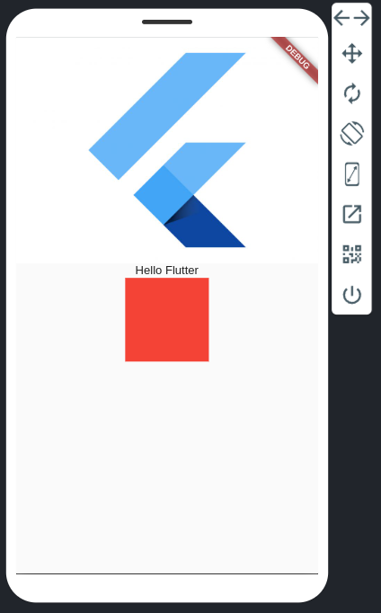
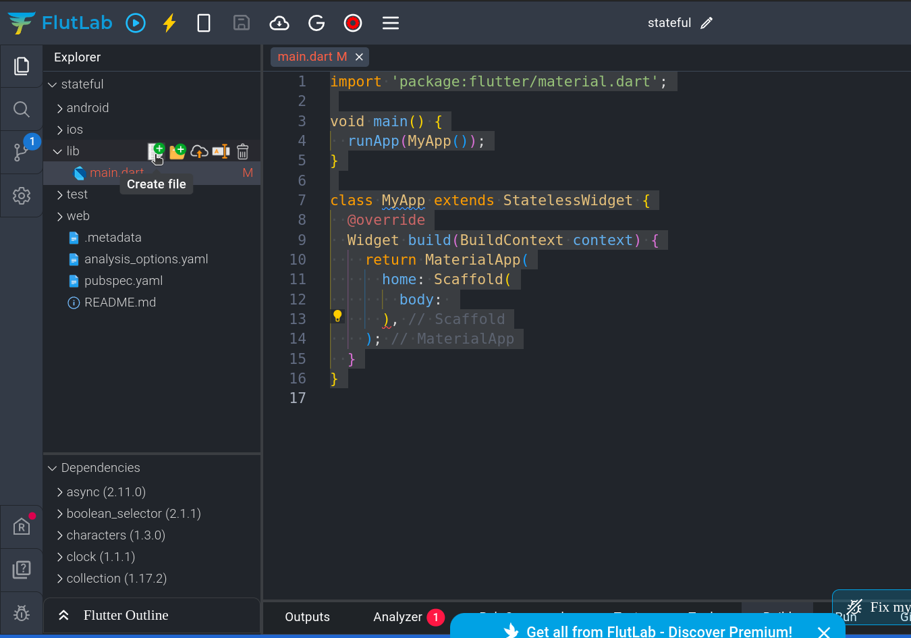
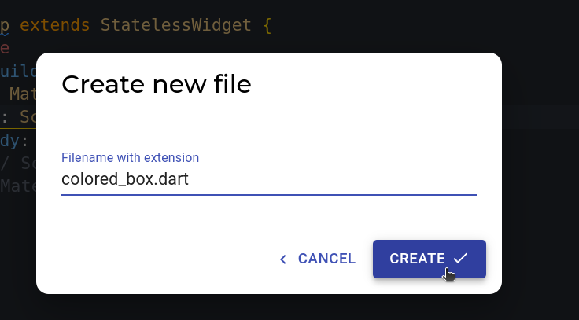

## State

Flutter ში ტერმინი "state"(ინფორმაციის მდგომარეობა) გამოიყენება აპლიკაციის მიმდინარე ინფორმაციის/მდგომარეობის აღსაწერად. აპლიკაციის მდგომარეობა(state) შეიძლება შეიცვალოს, გარკვეული დროის განმავლობაში, მომხმარებლის მიერ ინტერაქციის, ინტერნეტ რექვესთის ან სხვა რაიმე წყაროს გამო. მაგალითისთვის ქვემოთ მოცემულია აპლიკაციის კოდი და ვიზუალური გამოსახულება, რომლის state_ი (ინფორმაციის მდგომარეობა) არის: სურათის წყარო, ტექსტის მნიშვნელობა, კონტეინერის ფერი.

```dart
import 'package:flutter/material.dart';

void main() {
  runApp(MyApp());
}

class MyApp extends StatelessWidget {
  @override
  Widget build(BuildContext context) {
    return MaterialApp(
      home: Scaffold(
        body: Column(
          children: [
            Image.network(
                'https://logowik.com/content/uploads/images/flutter5786.jpg'),
            Text('Hello Flutter'),
            Container(
              color: Colors.red,
              width: 100,
              height: 100,
            ),
          ],
        ),
      ),
    );
  }
}


```



Flutter_ში გვაქვს ორი ტიპის ვიჯეტი: StatelessWidget და StatefulWidget. აქამდე ჩვენ ყოველთვის ვიყენებდით StatelessWidget_ს.


## StatelessWidget

StatelessWidget არის ვიჯეტი რომლის მდგომარეობა(state) არ იცვლება. ქვევით მოცემულია StatelessWidget_ის მაგალითი.

```dart
import 'package:flutter/material.dart';

void main() {
  runApp(MyApp());
}

class MyApp extends StatelessWidget {
  @override
  Widget build(BuildContext context) {
    return MaterialApp(
      home: Scaffold(
        body: Container(
          color: Colors.red,
          width: 100,
          height: 100,
        ),
      ),
    );
  }
}

```
მოცემულ მაგალითში ვიჯეტის state არის : Container ვიჯეტის ფერი, სიგანე და სიგრძე. დავუშვათ გვინდა მომხმარებელს მივცეთ საშვალება შეცვალოს კონტეინერის ფერი. StatelessWidget_ი ამის საშვალებას არ გვაძლევს, ამისათვის ჩვენ გვჭირდება StatefulWidget_ი. პირველ რიგში მოდით ჩვენს აპლიკაციაში დავამატოთ ღილაკი.

## TextButton 

Flutter_ში სხვადასხვა ვიზუალის ღილაკებს შევხვდებით, თუმცა ყველა ღილაკის ფუნქციონალი და სინტაქსი მსგავსია. ახლა მოდით შევითანოთ TextButton ვიჯეტი ჩვენს მაგალითში:

```dart
import 'package:flutter/material.dart';

void main() {
  runApp(MyApp());
}

class MyApp extends StatelessWidget {
  Color boxColor = Colors.red;

  void changeColor() {
    boxColor = Colors.blue;
  }

  @override
  Widget build(BuildContext context) {
    return MaterialApp(
      home: Scaffold(
        body: Column(

          children: [
            Container(
              color: boxColor,
              width: 100,
              height: 100,
            ),
            TextButton(
              onPressed: changeColor,
              child: Text('Click me'),
            )
          ],
        ),
      ),
    );
  }
}

```

მოცემულ მაგალითში რამდენიმე ცვლილება გვაქვს:
- იმისათვის რომ Scaffold_ში ერთზე მეტი ვიზუალური ვიჯეტი გვქონოდა დავამატეთ Column ვიჯეტი
- Column ვიჯეტში დავამატეთ TextButton ვიჯეტი
- Container ვიჯეტის ფერის პარამეტრის მნიშვნელობა გავიტანეთ ცვლადში სახელად boxColor
- TextButton ვიჯეტს ორი პარამეტრი აქვს: onPressed - მნიშვნელობად ელოდება ფუნქციის სახელს(დააკვირდი რომ ფუნქციას არ ვიძახებთ), რომელიც შესრულდება ღილაკზე დაჭერისას, child - ვიჯეტი რომელიც ვიზუალურად გამოჩნდება ეკრანზე
- MyApp კლასში დავამატეთ მეთოდი სახელად changeColor, რომელსაც TextButton ის onPressed პარამეტრში გადავცემთ. ფუნქციის ტანში კი ვცვლით boxColor ცვლადის მნიშნველობას
- და ბოლოს Column ვიჯეტი მოვათავსეთ ეკრანის ცენტრში ჰორიზონტალურად Center ვიჯეტის დახმარებით

ინტუიცურად შეიძლება იფიქრო, რომ ღილაკზე დაჭერისას კონტეინერის ფერი შეიცვლება, თუმცა როგორც უკვე ვთქვით StatelessWidget_ს ეს ფუნქციომნალი არ აქვს.

## StatefulWidget

იმისათვის რათა მომხმარებელზე ღილაკზე დაჭერისას კონტეინერის ფერის შეცვლა შეეძლოს ჩვენ StatefulWidget_ს გამოვიყენებთ. Flutter_ში ძალიან მარტივია StatelessWidget_ის გადაგცევა StatefulWidget_ად. ამისთვის კურსორი მოათავსე StatelessWidget_ზე და კლავიატურაზე დააჭირე ctrl + . შორთქათს. შემდეგ აირჩიე convert to StatefulWidget.

ამის შემდეგ ჩვენი აპლიკაციის კოდში რამდენიმე ცვლილება გვექნება:
- ჩვენი MyApp კლასი გახდა StatefulWidget ტიპის.
- MyApp კლასში გვაქვს ფუნქცია createState რომელიც _MyAppState კლასის ობიექტს ქმნის და აბრუნებს.
- _MyAppState კლასი რომელიც არის State ტიპის ('აექსთენდებს')
- _MyAppState აღვწერთ ჩვენთვის უკვე ცნობილ build მეთოდს, რომელშიც ჩვენთვის სასურველ დიზაინს ვქმნით

ამ ცვლილებების მიუხედავად თუკი ემულატორში Click me ღილაკს დავაჭერთ კონტეინერის ფერი მაინც არ იცვლება

## setState მეთოდი
setState მეთოდი არის ის ფუნქცია რომელსაც State კლასიდან მემკვიდრეობით ვიღებთ. ყოველთვის როდესაც გვსურს ეკრანზე რაიმე შეიცვალოს (მაგალითად კონტეინერის ფერი) Flutter_მა ჩვენი ლეიაუთი თავიდან უნდა დახატოს ეკრანზე (შეცვლილი State_ით). ამისთვის Flutter_ი ვიჯეტის build მეთოდს თავიდან გამოიძახებს. რადგან კლასში შეიძლება გვქონდეს სხვადასხვა დანიშნულების უამრავი ცვლადი, ძალიან არაეფექტური იქნებოდა თუკი ყველა ცვლადის მნიშვნელობის ცვლილებისას Flutter_ი ეკრანში შემავალ ვიჯეტებს თავიდან დახატავდა. ამიტომაც Flutter_ის დეველოპერებმა შექმნეს setState მეთოდი, რომლის დახმარებით ჩვენ შეგვიძლია Flutter_ს ვუთხრათ თუ რომელი ცვლადის მნიშვნელობის შეცვლიასას უნდა გამოიძახოს build მეთოდი თავიდან (ახლიდან დახატოს ეკრანი).
ახლა მოდით ვნახოთ setState მეთოდი მოქმედებაში


```dart
import 'package:flutter/material.dart';

void main() {
  runApp(MyApp());
}

class MyApp extends StatefulWidget {
  @override
  State<MyApp> createState() => _MyAppState();
}

class _MyAppState extends State<MyApp> {
  Color boxColor = Colors.red;

  void changeColor() {
    setState(() {
      boxColor = Colors.blue;
    });
  }

  @override
  Widget build(BuildContext context) {
    return MaterialApp(
      home: Scaffold(
        body: Center(
          child: Column(
            children: [
              Container(
                color: boxColor,
                width: 100,
                height: 100,
              ),
              TextButton(
                onPressed: changeColor,
                child: Text('Click me'),
              )
            ],
          ),
        ),
      ),
    );
  }
}

```

ზემოთ მოცემულ კოდში ერთადერთი ცვლილება changeColor მეთოდში გვაქს. სადაც boxColor ცვლადის ახალი მნიშნველობის მინიჭების ინსტრუქცია ჩავსვით setState მეთოდში.

## ვიჯეტების დანაწევრება

იმის მიუხედავად, რომ ჩვენი აპლიკაციები ზომაში პატარაა, მომავალში უფრო და უფრო კომპლექსური აპლიკაციების შექმნას დავიწყებთ. ამისათვის ჩვენ შეგვიძლია მხოლოდ ერთი main.dart ფაილი გამოვიყენოთ, თუმცა დიდი ზომის აპლიკაციის კოდის ერთ ფაილში მოთავსება ბევრ სირთულეს შეგვიქმნის მომავალში. ამიტომ მოდით ვნახოთ თუ როგორ შეგვიძლია ჩვენი აპლიკაცია სხვადასხვა ვიჯეტებსა და ფაილებში დავანაწევროთ. ჯერჯერობით მოდით ჩვენი აპლიკაციის კოდი ორ ფაილში გავანაწილოთ.
- main.dart ფაილში გვექნება StatelessWidget_ი რომელშიც მხოლოდ აპლიკაციის საწყისი კოდი გვექნება
- შევქმნით colored_box.dart ფაილს რომელშიც ჩვენი აპლიკაციის ვიზუალურ ნაწილს აღვწერთ.

პირველ რიგში გავასუფთავოთ main.dart ფაილი: 

```dart
import 'package:flutter/material.dart';

void main() {
  runApp(MyApp());
}

class MyApp extends StatelessWidget {
  @override
  Widget build(BuildContext context) {
    return MaterialApp(
      home: Scaffold(
        body: 
      ),
    );
  }
}

```

ახლა კი მოდით ვნახოთ როგორ შევქმნათ ახალი ფაილი ჩვენს პროექტში:
1. მაუსი მოათავსე lib ფოლდერზე რის შემდეგაც გამოგიჩნდება რამდენიმე აიქონი



2. დააჭირე ფაილის შექმნის ღილაკს (პირველი იქონი)
3. გამოსულ ფანჯარაში შეიყვანე ფაილის სახელი (colored_box.dart) ფაილის სახელი შეიძლება თვითონ აარჩიო, თუმცა .dart გაფართოების მინიშნება არ დაგავიწყდეს



4. დააჭირე ღილაკს create რის შემდეგაც lib ფოლდერში ჩვენს მიერ შექმნილი ფაილი დაემატება.

ამ ფაილში ჩვენ შევქმნით ColorBox ვიჯეტს რომელიც იქნება StatefulWidget_ი. ამისთვის კლავიატურაზე აკრიფე stf რის შემდეგაც გამოჩნდება პატარა ფანჯარა სადაც StatefulWidget_ის ეგრედწოდებულ Template გვექნება. დააჭირე enter_ს. შეიყვანე ვიჯეტის სახელი ColorBox და დააჭირე ESC ღილაკს კლავიატურაზე.
მიაქციე ყურადღება რომ ვიჯეტის სახელი რამდენიმე ადგიალს ჩაიწერა.


Flutter_ი ფაილში რამდენიმე სინტაქსურ შეცდომაზე მიგვანიშნებს. ამის გამოსწორება მარტივად import ინსტრუქციის დახმარებით შეგვიძლია.

ფაილის დასაწყისში დაამატე შემდეგი ინსტრუქცია: 

```dart
import 'package:flutter/material.dart';

```

ამით ჩვენს პროგრამაში შემოვიტანეთ Flutter_ის ბიბლიოთეკა. და ბოლოს დავაბრუნოთ ზემოთ განხილული მაგალითის ვიზუალური ნაწილი, changeColor მეთოდი და boxColor ცვლადი.

```dart

import 'package:flutter/material.dart';

class ColorBox extends StatefulWidget {

  @override
  State<ColorBox> createState() => _ColorBoxState();
}

class _ColorBoxState extends State<ColorBox> {
  Color boxColor = Colors.red;

  void changeColor() {
    setState(() {
      boxColor = Colors.blue;
    });
  }

  @override
  Widget build(BuildContext context) {
    return MaterialApp(
      home: Scaffold(
        body: Center(
          child: Column(
            children: [
              Container(
                color: boxColor,
                width: 100,
                height: 100,
              ),
              TextButton(
                onPressed: changeColor,
                child: Text('Click me'),
              )
            ],
          ),
        ),
      ),
    );
  }
}

```

ერთედერთი ცვლილების შეტანაღა დაგვრჩა main.dart ფაილში ჩვენ უნდა გამოვიძახოთ ახლად შექმნილი ColorBox ვიჯეტი.

```dart
import 'package:flutter/material.dart';
import 'package:stateful/colored_box.dart';

void main() {
  runApp(MyApp());
}

class MyApp extends StatelessWidget {
  @override
  Widget build(BuildContext context) {
    return MaterialApp(
      home: Scaffold(body: ColorBox()),
    );
  }
}

```

ყურადღება მიაქციე ახალ import ინსტრუქციას, რომლის დახმარებით main.dart ფაილს colored_box.dart ფაილის არსებობის შესახებ გავაგებინეთ.