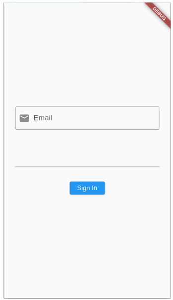
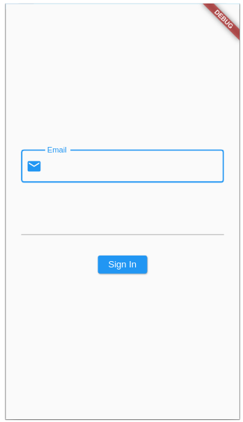
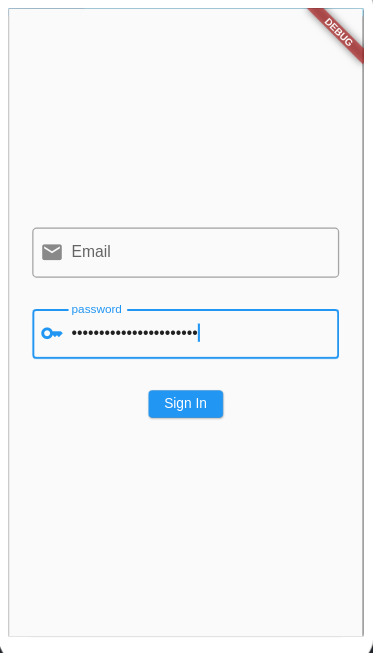
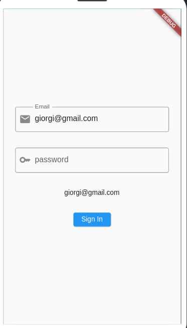
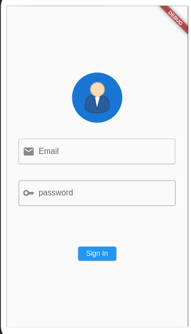
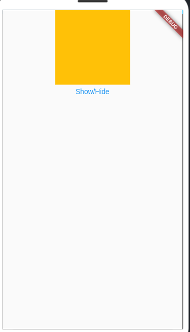

## პროექტის საწყისი კოდი
როგორც წინა გაკვეთილებში ვნახეთ, ჩვენი აპლიკაციის კოდი შეგვიძლია და სასურველიცაა, რომ დავყოთ სხვადასხვა ფაილებში, ფუნქციებში და ვიჯეტებში. ამ გაკვეთილს დავიწყებთ ორ ფაილიანი:
- main.dart - მოიცავს StatelessWidget_ს, MaterialApp ვიჯეტს და Scaffold ვიჯეტს. Scaffold ვიჯეტში კი გამოვიძახებთ მეორე ფაილში ჩვენს მიერ შექმნილ StatefulWidget_ს
- text_box_screen.dart - მოიცავს StatefulWidget_ს სახელად TextBoxScreen.

ჩვენი აპლიკაციის საწყისი ფაილები ასე გამოიყურება

### main.dart

```dart

import 'package:flutter/material.dart';
import 'package:lecture_04/text_box_screen.dart';

void main() {
  runApp(MyApp());
}

class MyApp extends StatelessWidget {
  @override
  Widget build(BuildContext context) {
    return MaterialApp(
      home: Scaffold(
        body: TextBoxScreen(),
      ),
    );
  }
}

```

!!! ყურადღება მიაქციე მეორე import ინსტრუქციას. პროექტის განსხვავებული სახელის შემთხვევაში ეს ინსტრუქციაც განსხვავებული იქნება

### text_box_screen.dart

```dart
import 'package:flutter/material.dart';

class TextBoxScreen extends StatefulWidget {

  @override
  State<TextBoxScreen> createState() {
    return _TextBoxScreenState();
  }
}

class _TextBoxScreenState extends State<TextBoxScreen> {
  @override
  Widget build(BuildContext context) {
    return const Placeholder();
  }
}

```

## ლეიაუთის სტრუქტური

გაკვეთილის ამ მაგალითში ჩვენ Sign-In გვერდის დიზაინს ავაწყობთ. ამიტომ მოდით ჯერჯერობით ავაწყოთ ლეიაუთის ძირითადი სტრუქტურა. ამისთვის ჩვენ გამოვიყენებთ:
- Column ვიჯეტს - ვიზუალური კომპონენტების ვერტიკალურად განლაგებისათვის
- TextField ვიჯეტებსს - მომხმარებლისაგან მეილისა და პაროლის მისაღებად
- ElevatedButton ვიჯეტს - რომელზე დაჭერისასაც მომხმარებელს რაიმე მესიჯს გამოვუტანთ 

ამ ვიჯეტების შეტანის შემდეგ TextBoxScreen ვიჯეტი ასე გამოიყურება:

```dart

import 'package:flutter/material.dart';

class TextBoxScreen extends StatefulWidget {
  @override
  State<TextBoxScreen> createState() {
    return _TextBoxScreenState();
  }
}

class _TextBoxScreenState extends State<TextBoxScreen> {
  @override
  Widget build(BuildContext context) {
    return Column(
      children: [
        TextField(),
        TextField(),
        ElevatedButton(
          onPressed: () {},
          child: Text('Sign In'),
        )
      ],
    );
  }
}


```

ხოლო აპლიკაციის გაშვებისას ვიღებთ შემდეგ ვიზუალს:


TextField ვიჯეტების default ვიზუალი არც ისე მომხიბვლელია თუმცა ამას მოგვიანებით გამოვასწორებთ. ახლა კი აქამდე ნასწავლი ვიჯეტების დახმარებით მთლიანი ლეიაუთის ვიზუალურ ნაწილზე ვიზრუნოთ:

```dart
import 'package:flutter/material.dart';

class TextBoxScreen extends StatefulWidget {
  @override
  State<TextBoxScreen> createState() {
    return _TextBoxScreenState();
  }
}

class _TextBoxScreenState extends State<TextBoxScreen> {
  @override
  Widget build(BuildContext context) {
    return Container(
      margin: EdgeInsets.symmetric(horizontal: 24),
      child: Column(
        mainAxisAlignment: MainAxisAlignment.center,
        children: [
          TextField(),
          SizedBox(
            height: 32,
          ),
          TextField(),
          SizedBox(
            height: 32,
          ),
          ElevatedButton(
            onPressed: () {},
            child: Text('Sign In'),
          )
        ],
      ),
    );
  }
}


```

გვაქვს ორი ცვლილება:
- TextField ვიჯეტებსა და ღილაკის ვიჯეტს შორის დავამატეთ SizedBox ვიჯეტი თავისუფალი ადგილის დასამატებლად
- Column ვიჯეტი ცავსვით Container ვიჯეტში, რამაც საშვალება მოგვცა Column ვიჯეტისათვის მიგვენიჭებინა მარჯინები.

ახლა კი მოდით TextField ვიჯეტის ვიზუალურ ნაწილზეც ვიზრუნოთ:

```dart
import 'package:flutter/material.dart';

class TextBoxScreen extends StatefulWidget {
  @override
  State<TextBoxScreen> createState() {
    return _TextBoxScreenState();
  }
}

class _TextBoxScreenState extends State<TextBoxScreen> {
  @override
  Widget build(BuildContext context) {
    return Container(
      margin: EdgeInsets.symmetric(horizontal: 24),
      child: Column(
        mainAxisAlignment: MainAxisAlignment.center,
        children: [
          TextField(
            decoration: InputDecoration(
              border: OutlineInputBorder(),
              prefixIcon: Icon(Icons.email),
              label: Text('Email'),
            ),
          ),
          SizedBox(
            height: 32,
          ),
          TextField(),
          SizedBox(
            height: 32,
          ),
          ElevatedButton(
            onPressed: () {},
            child: Text('Sign In'),
          )
        ],
      ),
    );
  }
}


```

პირველ TextField ვიჯეტში დავამატეთ decoration პარამეტრი, რომელიც მნიშვნელობად იღებს InputDecoration ობიექტს. InputDecoration კონსტრუქტორს უამრავი პარამეტრი აქვს, რომლებიც TextField ვიჯეტის ვიზუალურ მოდიფიკაციაში გვეხმარება. ჯერჯერობით ჩვენ მხოლოდ სამ პარამეტრს ვიყენებთ:

1. border - პარამეტრს შეგვიძლია გადავცეთ ორი წინასწარ გამზადებული TextField ვიჯეტის დიზაინი OutlineInputBorder და UnderlineInputBorder. UnderlineInputBorder არის default მნიშვნელობა ხოლო OutlineInputBorder_ს ქვემოთ ვნახავთ
2. prefixIcon - პარამეტრს გადავეცით Icon ობიექტი, Icon ობიექტში კი Icons კლასიდან ავირჩიეთ კონვერტის აიქონი.
3. label - პარამეტრს გადავეცით Text ვიჯეტი, რომელიც მომხმარებელს მიუთითებს თუ რა სახის ინფორმაციას ვითხოვთ მისგან. ალტერნატიულად შეგვეძლო გამოგვეყენებინა hintText პარამეტრი, რომელსაც მსგავსი დიზაინი და დანიშნულება აქვს

ამ პარამეტრების მითითების შემდეგ ჩვენი email TextField ასე გამოიყურება:





ახლა მოდით ჩვენს პაროლის Textfield ვიჯეტსაც გავუწეროთ decoration პარამეტრი შესაბამისი იქონითა და label ტექსტით:

```dart
import 'package:flutter/material.dart';

class TextBoxScreen extends StatefulWidget {
  @override
  State<TextBoxScreen> createState() {
    return _TextBoxScreenState();
  }
}

class _TextBoxScreenState extends State<TextBoxScreen> {
  @override
  Widget build(BuildContext context) {
    return Container(
      margin: EdgeInsets.symmetric(horizontal: 24),
      child: Column(
        mainAxisAlignment: MainAxisAlignment.center,
        children: [
          TextField(
            decoration: InputDecoration(
              border: OutlineInputBorder(),
              prefixIcon: Icon(Icons.email),
              label: Text('Email'),
            ),
          ),
          SizedBox(
            height: 32,
          ),
          TextField(
            decoration: InputDecoration(
              border: OutlineInputBorder(),
              prefixIcon: Icon(Icons.key),
              label: Text('password'),
            ),
          ),
          SizedBox(
            height: 32,
          ),
          ElevatedButton(
            onPressed: () {},
            child: Text('Sign In'),
          )
        ],
      ),
    );
  }
}


```
## obscureText პარამეტრი

ხშირად, როდესაც აპლიკაცია მომხმარებლისაგან სენსიტიური ინფორმაციის შეყვანას ითხოვს (მაგ. პაროლების) კარგი პრაქტიკაა ამ ინფორმაციის დამალვა. ამის გაკეთება მარტივად შეგვიძლია obscureText პარამეტრის დახმარებით. obscureText პარამეტრი მნიშნველობად იღებს boolean მონაცემის ტიპის მნიშვნელობას და თუ ეს მნიშნველობა არის true TextField ვიჯეტში მომხმარებლის მიერ შეყვანილი ინფორმაცია 'დაიმალება'

```dart
import 'package:flutter/material.dart';

class TextBoxScreen extends StatefulWidget {
  @override
  State<TextBoxScreen> createState() {
    return _TextBoxScreenState();
  }
}

class _TextBoxScreenState extends State<TextBoxScreen> {
  @override
  Widget build(BuildContext context) {
    return Container(
      margin: EdgeInsets.symmetric(horizontal: 24),
      child: Column(
        mainAxisAlignment: MainAxisAlignment.center,
        children: [
          TextField(
            decoration: InputDecoration(
              border: OutlineInputBorder(),
              prefixIcon: Icon(Icons.email),
              label: Text('Email'),
            ),
          ),
          SizedBox(
            height: 32,
          ),
          TextField(
            obscureText: true,
            decoration: InputDecoration(
              border: OutlineInputBorder(),
              prefixIcon: Icon(Icons.key),
              label: Text('password'),
            ),
          ),
          SizedBox(
            height: 32,
          ),
          ElevatedButton(
            onPressed: () {},
            child: Text('Sign In'),
          )
        ],
      ),
    );
  }
}

```
როგორც შეამჩნიე პაროლის TextField ვიჯეტს დავამატეთ პარამეტრი obscureText და მნიშვნელობად გავუწერეთ true. ამის შემდეგ ამ TextField ში შეყვანილი ინფორმაცია ასე გამოიყურება:



## TextEditingController

იმისათვის, რომ TextField ვიჯეტებში, მომხმარებლის მიერ შეყვანილი ინფორმაციის დამუშავება შევძლოთ გამოვიყენებთ TextEditingController ობიექტს.
ეს ობიექტი გვიმარტივებს TextField ვიჯეტებთან მუშაობას. (ალტერნატიულად შეგვეძლო იგივე ფუნქციონალი ჩვენით შეგვექმნა)

ახლა ჩვენ შევქმნით ორ ობიექტს რომლის ტიპი იქნება TextEditingController, შემდეგ TextField ვიჯეტებს დავუკავშირებთ ამ ობიექტებს, რის შემდეგაც შეგვეძლება მეილისა და პაროლის TextField ვიჯეტების 'კონსტროლი' (TextField_ებთან ასოცირებული/ხშირად გამოყენებადი ფუნქციონალის შესრულება)

```dart

import 'package:flutter/material.dart';

class TextBoxScreen extends StatefulWidget {
  @override
  State<TextBoxScreen> createState() {
    return _TextBoxScreenState();
  }
}

class _TextBoxScreenState extends State<TextBoxScreen> {

  TextEditingController emailController = TextEditingController();
  TextEditingController passwordController = TextEditingController();

  @override
  Widget build(BuildContext context) {
    return Container(
      margin: EdgeInsets.symmetric(horizontal: 24),
      child: Column(
        mainAxisAlignment: MainAxisAlignment.center,
        children: [
          TextField(
            controller: emailController,
            decoration: InputDecoration(
              border: OutlineInputBorder(),
              prefixIcon: Icon(Icons.email),
              label: Text('Email'),
            ),
          ),
          SizedBox(
            height: 32,
          ),
          TextField(
            controller: passwordController,
            decoration: InputDecoration(
              border: OutlineInputBorder(),
              prefixIcon: Icon(Icons.key),
              label: Text('password'),
            ),
          ),
          SizedBox(
            height: 32,
          ),
          ElevatedButton(
            onPressed: () {},
            child: Text('Sign In'),
          )
        ],
      ),
    );
  }
}

```
რეალურ აპლიკაციაში რათამქუნდა მომხმარებლის მიერ შეყვანილ იმეილსა და პარაოლს გამოვიყენებდით მომხმარებლის აუტორიზაციისათვის, თუმცა ახლა მოდით უბრალოდ Sign-In ღილაკზე დაჭერისას გამოვაჩინოთ ტექსტი რომელიც მომხმარებლის იმეილს შეიცავს:

ამისთვის დაგვჭირდება:
1. ლეიაუთში დავამატოთ Text ვიჯეტი
2. Text ვიჯეტის String მნიშნველობა გავიტანოთ ცვლადში
3. Sign-In ღილაკზე დაჭერისას Text ვიჯეტში ჩავწეროთ მომხმარებლის იმეილი

```dart
import 'package:flutter/material.dart';

class TextBoxScreen extends StatefulWidget {
  @override
  State<TextBoxScreen> createState() {
    return _TextBoxScreenState();
  }
}

class _TextBoxScreenState extends State<TextBoxScreen> {
  TextEditingController emailController = TextEditingController();
  TextEditingController passwordController = TextEditingController();

  String userMail = '';

  @override
  Widget build(BuildContext context) {
    return Container(
      margin: EdgeInsets.symmetric(horizontal: 24),
      child: Column(
        mainAxisAlignment: MainAxisAlignment.center,
        children: [
          TextField(
            controller: emailController,
            decoration: InputDecoration(
              border: OutlineInputBorder(),
              prefixIcon: Icon(Icons.email),
              label: Text('Email'),
            ),
          ),
          SizedBox(
            height: 32,
          ),
          TextField(
            obscureText: true,
            controller: passwordController,
            decoration: InputDecoration(
              border: OutlineInputBorder(),
              prefixIcon: Icon(Icons.key),
              label: Text('password'),
            ),
          ),
          SizedBox(
            height: 32,
          ),
          Text(userMail),
          SizedBox(
            height: 32,
          ),
          ElevatedButton(
            onPressed: () {
              setState(() {
                userMail = emailController.text;
              });
            },
            child: Text('Sign In'),
          )
        ],
      ),
    );
  }
}

```

ყურადღება მიაქციე ElevatedButton ვიჯეტის onPressed პარამეტრს. აქ ჩვენ setState ფუნქციის დახმარებით userMail ცვლადში შევიტანეთ მომხმარებლის მიერ შეყვანილი მეილი.
TextEditingController ობიექტს აქვს პარამეტრი text რომელიც ყოველთვის აბურნებს იმ ინფორმაციას, რაც კონკრეტულ მომენტში წერია TextField ვიჯეტში.

Sign-In ღილაკზე დაჭერის შემდეგ გამოგვიჩნდება ჩვენი Text ვიჯეტი მომხმარებლის მეილით.



## CircleAvatar ვიჯეტი

ჩვენი Sign-In გვერდი ვიზუალურად ასე თუ ისე დავხვეწეთ, მაგრამ რაც გვაკლია არის სურათი, რომელიც თითქმის ყველა რეალური აპლიკაციის Sign-In გვერდებზე გვხვდება.
ეს სურათი შეიძლება იყოს კომპანიის ლოგო ან მომხმარებლის სურათი. ამის გაკეთება ჩვენ რათქმაუნდა უკვე ვიცით Image ვიჯეტის დახმარებით, ამიტომ მოდით ვნახოთ ახალი ვიჯეტი CircleAvatar რომელსაც default_ად გარკვეული დიზაინი უკვე აქვს:

```dart
import 'package:flutter/material.dart';

class TextBoxScreen extends StatefulWidget {
  @override
  State<TextBoxScreen> createState() {
    return _TextBoxScreenState();
  }
}

class _TextBoxScreenState extends State<TextBoxScreen> {
  TextEditingController emailController = TextEditingController();
  TextEditingController passwordController = TextEditingController();

  String userMail = '';

  @override
  Widget build(BuildContext context) {
    return Container(
      margin: EdgeInsets.symmetric(horizontal: 24),
      child: Column(
        mainAxisAlignment: MainAxisAlignment.center,
        children: [
          CircleAvatar(
            radius: 50,
            child: Container(
              width: 50,
              child: Image.network(
                  'https://upload.wikimedia.org/wikipedia/commons/thumb/9/96/User_icon-cp.png/1200px-User_icon-cp.png'),
            ),
          ),
          SizedBox(
            height: 32,
          ),
          TextField(
            controller: emailController,
            decoration: InputDecoration(
              border: OutlineInputBorder(),
              prefixIcon: Icon(Icons.email),
              label: Text('Email'),
            ),
          ),
          SizedBox(
            height: 32,
          ),
          TextField(
            obscureText: true,
            controller: passwordController,
            decoration: InputDecoration(
              border: OutlineInputBorder(),
              prefixIcon: Icon(Icons.key),
              label: Text('password'),
            ),
          ),
          SizedBox(
            height: 32,
          ),
          Text(userMail),
          SizedBox(
            height: 32,
          ),
          ElevatedButton(
            onPressed: () {
              setState(() {
                userMail = emailController.text;
              });
            },
            child: Text('Sign In'),
          )
        ],
      ),
    );
  }
}

```

Column ვიჯეტის პირველ შვილად დავამატეთ CircleAvatar ვიჯეტი რომელშიც:
- child პარამეტრად მოცემული გვაქვს Container ვიჯეტი სიგანით 50 ერთეული.
- Container ვიჯეტს თავის მხრივ child პარამეტრში მნიშვნელობად Image ვიჯეტს გადავცემთ.
- CircleAvatar ვიჯეტის კიდევ ერთ პარამეტრ radius_ს ვიყენებთ რომლის დახმარებით ამ ვიჯეტის ზომას განვსაზღვრავთ

ამ ცვლილებების შემდეგ ჩვენი Sign-In გვერდი ასე გამოიყურება:




## Visibility ვიჯეტი

ხშირად ჩვენს აპლიკაციაში გვჭირდება რაიმე ვიჯეტის დამალვა/გამოჩენა მომხმარებლის ინტერაქციის დროს. ამისთვის შეგვიძლია გამოვიყენოთ Visibility ვიჯეტი.
Visibility ვიჯეტის გასაცნობად მოდით შევქმნათ მარტივი მაგალითი:

!!! აქ ახალი პროექტი არ შეგვიგქმნია. ჩვენ უბრალოდ TextBoxScreen ვიჯეტში არსებული Column ვიჯეტი გამოვიყენეთ

```dart
import 'package:flutter/material.dart';

class TextBoxScreen extends StatefulWidget {
  @override
  State<TextBoxScreen> createState() {
    return _TextBoxScreenState();
  }
}

class _TextBoxScreenState extends State<TextBoxScreen> {
  @override
  Widget build(BuildContext context) {
    return Center(
      child: Column(
        children: [
          Container(
            width: 150,
            height: 150,
            color: Colors.amber,
          ),
          TextButton(onPressed: () {}, child: Text('Show/Hide'))
        ],
      ),
    );
  }
}


```

ჩვენს მიერ აწყობილი ლეიაუთი ასე გამოიყურება:



Show/Hide ღილაკზე დაჭერისას გვინდა, რომ Container ვიჯეტი გავაქროთ გამოვაჩინოთ, ამისთვის: 

- იმ ვიჯეტს რომლის გაქრობა/გამოჩენაც გვინდა ჩავსვავთ Visibility ვიჯეტში
- შევქმნით boolean მონაცემის ტიპის ცვლადს isVisible default მნიშვნელობით true
- Visibility ვიჯეტის პარამეტრს visible მივანიჭებთ ამ ცვლადის მნიშვნელობას
- Show/Hide ღილაკზე დაჭერისას შევცვლით isVisible ცვლადის მნიშვნელობას საპირისპირო მნიშვნელობით ! (არა ოპერატორი)_ს გამოყენებით

ამ ცვლილებების შეტანის შემდეგ ჩვენი კოდი ასე გამოიყურება:

```dart
import 'package:flutter/material.dart';

class TextBoxScreen extends StatefulWidget {
  @override
  State<TextBoxScreen> createState() {
    return _TextBoxScreenState();
  }
}

class _TextBoxScreenState extends State<TextBoxScreen> {
  bool isVisible = true;

  @override
  Widget build(BuildContext context) {
    return Center(
      child: Column(
        children: [
          Visibility(
            visible: isVisible,
            child: Container(
              width: 150,
              height: 150,
              color: Colors.amber,
            ),
          ),
          TextButton(
              onPressed: () {
                setState(() {
                  isVisible = !isVisible;
                });
              },
              child: Text('Show/Hide'))
        ],
      ),
    );
  }
}


```
