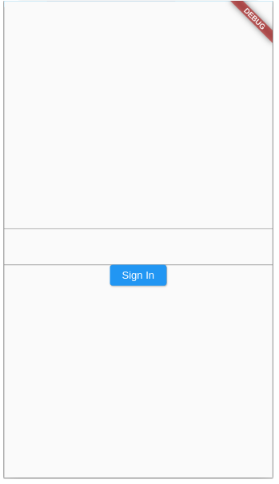

## პროექტის საწყისი კოდი
როგორც წინა გაკვეთილებში ვნახეთ, ჩვენი აპლიკაციის კოდი შეგვიძლია და სასურველიცაა, რომ დავყოთ სხვადასხვა ფაილებში, ფუნქციებში და ვიჯეტებში. ამ გაკვეთილს დავიწყებთ ორ ფაილიანი:
- main.dart - მოიცავს StatelessWidget_ს, MaterialApp ვიჯეტს და Scaffold ვიჯეტს. Scaffold ვიჯეტში კი გამოვიძახებთ მეორე ფაილში ჩვენს მიერ შექმნილ StatefulWidget_ს
- text_box_screen.dart - მოიცავს StatefulWidget_ს სახელად TextBoxScreen.

ჩვენი აპლიკაციის საწყისი ფაილები ასე გამოიყურება

### main.dart

```dart

import 'package:flutter/material.dart';
import 'package:lecture_04/text_box_screen.dart';

void main() {
  runApp(MyApp());
}

class MyApp extends StatelessWidget {
  @override
  Widget build(BuildContext context) {
    return MaterialApp(
      home: Scaffold(
        body: TextBoxScreen(),
      ),
    );
  }
}

```

!!! ყურადღება მიაქციე მეორე import ინსტრუქციას. პროექტის განსხვავებული სახელის შემთხვევაში ეს ინსტრუქციაც განსხვავებული იქნება

### text_box_screen.dart

```dart
import 'package:flutter/material.dart';

class TextBoxScreen extends StatefulWidget {

  @override
  State<TextBoxScreen> createState() {
    return _TextBoxScreenState();
  }
}

class _TextBoxScreenState extends State<TextBoxScreen> {
  @override
  Widget build(BuildContext context) {
    return const Placeholder();
  }
}

```

## ლეიაუთის სტრუქტური

გაკვეთილის ამ მაგალითში ჩვენ Sign-In გვერდის დიზაინს ავაწყობთ. ამიტომ მოდით ჯერჯერობით ავაწყოთ ლეიაუთის ძირითადი სტრუქტურა. ამისთვის ჩვენ გამოვიყენებთ:
- Column ვიჯეტს - ვიზუალური კომპონენტების ვერტიკალურად განლაგებისათვის
- TextField ვიჯეტებსს - მომხმარებლისაგან მეილისა და პაროლის მისაღებად
- ElevatedButton ვიჯეტს - რომელზე დაჭერისასაც მომხმარებელს რაიმე მესიჯს გამოვუტანთ 

ამ ვიჯეტების შეტანის შემდეგ TextBoxScreen ვიჯეტი ასე გამოიყურება:

```dart

import 'package:flutter/material.dart';

class TextBoxScreen extends StatefulWidget {
  @override
  State<TextBoxScreen> createState() {
    return _TextBoxScreenState();
  }
}

class _TextBoxScreenState extends State<TextBoxScreen> {
  @override
  Widget build(BuildContext context) {
    return Column(
      children: [
        TextField(),
        TextField(),
        ElevatedButton(
          onPressed: () {},
          child: Text('Sign In'),
        )
      ],
    );
  }
}


```

ხოლო აპლიკაციის გაშვებისას ვიღებთ შემდეგ ვიზუალს:



TextField ვიჯეტების default ვიზუალი არც ისე მომხიბვლელია თუმცა ამას მოგვიანებით გამოვასწორებთ. ახლა კი აქამდე ნასწავლი ვიჯეტების დახმარებით მთლიანი ლეიაუთის ვიზუალურ ნაწილზე ვიზრუნოთ:

```dart
import 'package:flutter/material.dart';

class TextBoxScreen extends StatefulWidget {
  @override
  State<TextBoxScreen> createState() {
    return _TextBoxScreenState();
  }
}

class _TextBoxScreenState extends State<TextBoxScreen> {
  @override
  Widget build(BuildContext context) {
    return Container(
      margin: EdgeInsets.symmetric(horizontal: 24),
      child: Column(
        mainAxisAlignment: MainAxisAlignment.center,
        children: [
          TextField(),
          SizedBox(
            height: 32,
          ),
          TextField(),
          SizedBox(
            height: 32,
          ),
          ElevatedButton(
            onPressed: () {},
            child: Text('Sign In'),
          )
        ],
      ),
    );
  }
}


```

გვაქვს ორი ცვლილება:
- TextField ვიჯეტებსა და ღილაკის ვიჯეტს შორის დავამატეთ SizedBox ვიჯეტი თავისუფალი ადგილის დასამატებლად
- Column ვიჯეტი ცავსვით Container ვიჯეტში, რამაც საშვალება მოგვცა Column ვიჯეტისათვის მიგვენიჭებინა მარჯინები.

ახლა კი მოდით TextField ვიჯეტის ვიზუალურ ნაწილზეც ვიზრუნოთ:

```dart
import 'package:flutter/material.dart';

class TextBoxScreen extends StatefulWidget {
  @override
  State<TextBoxScreen> createState() {
    return _TextBoxScreenState();
  }
}

class _TextBoxScreenState extends State<TextBoxScreen> {
  @override
  Widget build(BuildContext context) {
    return Container(
      margin: EdgeInsets.symmetric(horizontal: 24),
      child: Column(
        mainAxisAlignment: MainAxisAlignment.center,
        children: [
          TextField(
            decoration: InputDecoration(
              border: OutlineInputBorder(),
              prefixIcon: Icon(Icons.email),
              label: Text('Email'),
            ),
          ),
          SizedBox(
            height: 32,
          ),
          TextField(),
          SizedBox(
            height: 32,
          ),
          ElevatedButton(
            onPressed: () {},
            child: Text('Sign In'),
          )
        ],
      ),
    );
  }
}


```

პირველ TextField ვიჯეტში დავამატეთ decoration პარამეტრი, რომელიც მნიშვნელობად იღებს InputDecoration ობიექტს. InputDecoration კონსტრუქტორს უამრავი პარამეტრი აქვს, რომლებიც TextField ვიჯეტის ვიზუალურ მოდიფიკაციაში გვეხმარება. ჯერჯერობით ჩვენ მხოლოდ სამ პარამეტრს ვიყენებთ:

1. border - პარამეტრს შეგვიძლია გადავცეთ ორი წინასწარ გამზადებული TextField ვიჯეტის დიზაინი OutlineInputBorder და UnderlineInputBorder. UnderlineInputBorder არის default მნიშვნელობა ხოლო OutlineInputBorder_ს ქვემოთ ვნახავთ
2. prefixIcon - პარამეტრს გადავეცით Icon ობიექტი, Icon ობიექტში კი Icons კლასიდან ავირჩიეთ კონვერტის აიქონი.
3. label - პარამეტრს გადავეცით Text ვიჯეტი, რომელიც მომხმარებელს მიუთითებს თუ რა სახის ინფორმაციას ვითხოვთ მისგან. ალტერნატიულად შეგვეძლო გამოგვეყენებინა hintText პარამეტრი, რომელსაც მსგავსი დიზაინი და დანიშნულება აქვს

ამ პარამეტრების მითითების შემდეგ ჩვენი email TextField ასე გამოიყურება:


