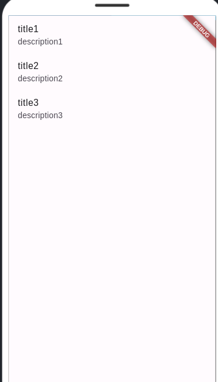
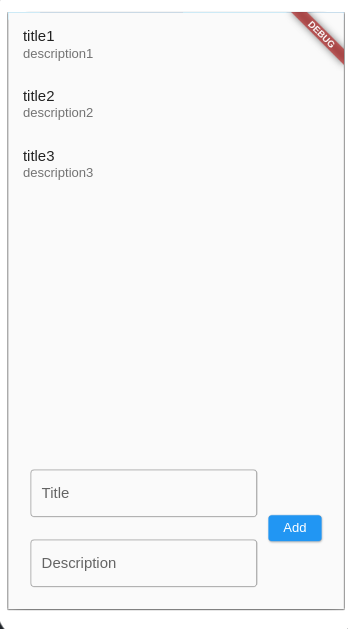

## TO-DO app

ამ გაკვეთილში ჩვენ ვნახავთ თუ როგორ შევქმნათ ეგრედ წოდებული Todo აპლიკაციის ფუნქციონალი. მსგავსი პროგრამა ჩვენ ადრეც შევქმენით, როდესაც დარტში კლასებსა და ობიექტებს შევისწავლიდით. მაშინ Dartpad_ში საშვალება არ გვქონდა მომხმარებლისაგან მიგვეღო ინფორმაციები. ახლა კი Flutter_ის დახმარებით ეს უკვე შეგვიძლია. ჯერჯერობით ჩვენი Todo აპლიკაცია მარტივი იქნება მომავალ გაკვეთილებზე კი მას დავხვეწავთ და მეტ ფუნქციონალს დავამატებთ.

## აპლიკაციის საწყისი კოდი
დასაწყისისთვის ჩვენი აპლიკაცია ორი ფაილისაგან შედგება: main.dart და todo_screen.dart 

### main.dart

```dart
import 'package:flutter/material.dart';
import 'package:todo/todo_screen.dart';

void main() {
  runApp(MyApp());
}

class MyApp extends StatelessWidget {
  // This widget is the root of your application.
  @override
  Widget build(BuildContext context) {
    return MaterialApp(
      home: Scaffold(
        body: TodoScreen(),
      ),
    );
  }
}


```

### todo_screen.dart
```dart
import 'package:flutter/material.dart';

class TodoScreen extends StatefulWidget {
  @override
  State<TodoScreen> createState() {
    return _TodoScreenState();
  }
}

class _TodoScreenState extends State<TodoScreen> {
  @override
  Widget build(BuildContext context) {
    return const Placeholder();
  }
}

```

!!! არ დაგავიწყდეს lib ფოლდერში ფაილის დამატება, ასევე პროექტისა და ფაილის განსხვავებული სახელის შემთხვევაში import ინსტრუქცია main.dart ფაილში განსხვავებული იქნება.

## TodoItem და TodoList კლასები
როდესაც დარტში კლასებს შევისწავლიდით შევქმენით ორი კლასი TodoItem და TodoList. სწორედ ამ კლასებს გამოვიყენებთ ჩვენი აპლიკაციაში არსებული ობიექტების აღსაწერად

შექმენი ახალი ფაილი სახელად todo.dart, lib ფოლდერში და გადაიტანე ქვემოთ მოცემული ორი კლასი

### TodoItem
```dart

class TodoItem {
    String title;
    String description;

    TodoItem({required this.title, required this.description});

    String toString() {
        return 'TodoItem{title: $title, description: $description}';
    }
}

```


### TodoList
```dart
class TodoList {
    List<TodoItem> todoItems = [];


    void addTodo(TodoItem todoItem) {
        todoItems.add(todoItem);
    }

    void removeTodo(TodoItem todoItem) {
        todoItems.remove(todoItem);
    }

    void printTodoList() {
        for(int i = 0; i < todoItems.length; i++) {
            print('${todoItems[i]}');
        }
    }
}
```

## ListView ვიჯეტი

Flutter_ში სიების ვიზუალური გამოსახვისთვის სხვადასხვა ვიჯეტს შევხვდებით. დღეს ამ ვიჯეტებიდან ერთერთს ListView_ს განვიხილავთ. ListView საშვალებას გვაძლევს ერთიდაიგივე ვიზუალის მქონე ვიჯეტების (რომელიც სიის ელემენტის ვიზუალური რეპრეზენტაციაა) ეკრანზე ეფექტურუად (აპლიკაციის პერფორმანსის მხრივ) დახატვაში გვეხმარება.

იმისათვის რომ ListView ვიჯეტი ვიზუალურად დავინახოთ ჩვენი ემულატორის ეკრანზე მოდით ჯერჯერობით შევქმნათ ცვლადი რომელიც შეინახავს TodoList ობიექტს და დავამატოთ რამდენიმე TodoItem ობიექტი.

```dart
import 'package:flutter/material.dart';
import 'package:todo/todo.dart';

class TodoScreen extends StatefulWidget {
  @override
  State<TodoScreen> createState() {
    return _TodoScreenState();
  }
}

class _TodoScreenState extends State<TodoScreen> {
  TodoList todos = TodoList();

  @override
  Widget build(BuildContext context) {
    todos.addTodo(TodoItem(
      title: 'title1',
      description: 'description1',
    ));
    todos.addTodo(TodoItem(
      title: 'title2',
      description: 'description2',
    ));
    todos.addTodo(TodoItem(
      title: 'title3',
      description: 'description3',
    ));

    return const Placeholder();
  }
}


```

ახლა მოდით შევიტანოთ ListView ვიჯეტი TodoScreen StatefulWidget_ის build მეთოდში. ამჯერად გამოვიყენებთ ListView კლასის ერთერთ ფუნქციას (რომელიც კონსტრუქტორია) builder_ს.

```dart
import 'package:flutter/material.dart';
import 'package:todo/todo.dart';

class TodoScreen extends StatefulWidget {
  @override
  State<TodoScreen> createState() {
    return _TodoScreenState();
  }
}

class _TodoScreenState extends State<TodoScreen> {
  TodoList todos = TodoList();

  @override
  Widget build(BuildContext context) {
    todos.addTodo(TodoItem(
      title: 'title1',
      description: 'description1',
    ));
    todos.addTodo(TodoItem(
      title: 'title2',
      description: 'description2',
    ));
    todos.addTodo(TodoItem(
      title: 'title3',
      description: 'description3',
    ));

    return ListView.builder(
      itemCount: todos.todoItems.length,
      itemBuilder: (context, index) {
        
      },
    );
  }
}


```

როგორც ხედავთ TodoScreen ვიჯეტში დავამატეთ ListView ვიჯეტი, builder ფუნქციის დახმარებით. builder მეთოდს გადავცემთ ორ პარამეტრს:
1. itemCount - მნიშვნელობად იღებს ინტეჯერს რომლითაც ListView_ს ვეუბნებით თუ რამდენი ელემენტის გამოსახვა მოუწევს
2. itemBuilder - მნიშვნელობად იღებს ფუნქციას რომელმაც უნდა დააბრუნოს ის ვიზუალური ვიჯეტი რომელიც დაიხატება სიაში ყოველი ელემენტის ადგილას.

ListView ვიჯეტის ელემენტების დასახატად ჩცენ გამოვიყენებთ ListTile ვიჯეტს, ეს ვიჯეტი გვიმარტივებს სიების ელემენტების შექმნას (ალტერნატიულად შეგვეძლო სასურველი ვიზუალი თავად შეგვექმნა)

```dart
import 'package:flutter/material.dart';
import 'package:todo/todo.dart';

class TodoScreen extends StatefulWidget {
  @override
  State<TodoScreen> createState() {
    return _TodoScreenState();
  }
}

class _TodoScreenState extends State<TodoScreen> {
  TodoList todos = TodoList();

  @override
  Widget build(BuildContext context) {
    todos.addTodo(TodoItem(
      title: 'title1',
      description: 'description1',
    ));
    todos.addTodo(TodoItem(
      title: 'title2',
      description: 'description2',
    ));
    todos.addTodo(TodoItem(
      title: 'title3',
      description: 'description3',
    ));

    return ListView.builder(
      itemCount: todos.todoItems.length,
      itemBuilder: (context, index) {
        return ListTile(
          title: Text(todos.todoItems[index].title),
          subtitle: Text(todos.todoItems[index].description),
        );
      },
    );
  }
}


```

როგორც ხედავ itemBuilder პარამეტრში გადაცემულ ფუნქციაში ჩვენ ვაბრუნებთ ListTile ვიჯეტს. თავის მხრივ ListTile ვიჯეტის ორ პარამეტრს ვიყენებთ.
1. title - რომელშიც დავამატეთ Text ვიჯეტი და გადავცემთ String_ს. TodoItem ის პარამეტრს title_ს (იგივე სახელმა არ დაგაბნიოთ)
2. subTitle - რომელშიც დავამატეთ Text ვიჯეტი და გადავცემთ String_ს. TodoItem ის პარამეტრს description 

ყურადღება მივაქციოთ index_ს, როდესაც Flutter_ი დაიწყებს ჩვენი ListView ვიჯეტის ეკრანზე დახატვას, ის ყველა ელემენტისათვის გამოიძახებს itemBuilder_ში გადაცემულ ფუნქციას. index_ის მნიშვნელობასაც სწორედ Flutter_ი გადმოსცემს ჩვენს მიერ აღწერილ ფუნქციას. (პირველი ელემენტის დახატვისას ინდექსი იქნება 0, მეორეზე 1 და ა.შ)

ჩვენი აპლიკაციის გაშვების შემდეგ მივიღებთ შემდეგ ვიზუალს:



ახლა უკვე შეგვიძლია სიაში ელემენტების დამატების საშვალება მომხმარებელს მივცეთ

## ახალი ელემენტის დამატების ფუნქციონალი

პირველ რიგში მოდით შევქმნათ შესაბამისი ვიჯეტების ლეიაუთი, რომელიც მომხმარებელს საშვალებას მისცეს შეიყვანოს TodoItem_ის სათაუდი და აღწერა, შემდეგ კი დაამატოს ის ListView_ში.

პირველ რიგში ჩვენი ListView ვიჯეტი ჩავსვათ Column ვიჯეტში. რის შემდეგაც ემულატორის ეკრანიდან ListView ვიჯეტი გაქრება. ამის მიზეზი მარტივია, Column ვიჯეტი ცდილობს შვილ ვიჯეტებს თავისუფალი ადგილი თანაბრად გადაუნაწილოს, ListView ვიჯეტი კი ცდილობს თავისუფალი ადგილი მთლიანად დაიკავოს. ამ პრობლემის მოგვარებაც მარტივია ListView ვიჯეტს ჩავსვავთ Expanded ვიჯეტში. Expanded ვიჯეტი საშვალებას გვაძლევს ისეთი ვიჯეტები როგორიც ListView_ა მოვაქციოთ გარკვეულ საზღვრებში (არ მივცეთ უფლება მშობლის ანუ Column ვიჯეტის თავისუფალი ადგილი მთლიანად მიიტაცოს). ამის შემდეგ ListView ვიჯეტი კვლავ დაბრუნდა ემულატორის ეკრანზე. ხოლო ჩვენი კოდი ასე გამოიყურება:

```dart
import 'package:flutter/material.dart';
import 'package:todo/todo.dart';

class TodoScreen extends StatefulWidget {
  @override
  State<TodoScreen> createState() {
    return _TodoScreenState();
  }
}

class _TodoScreenState extends State<TodoScreen> {
  TodoList todos = TodoList();

  @override
  Widget build(BuildContext context) {
    todos.addTodo(TodoItem(
      title: 'title1',
      description: 'description1',
    ));
    todos.addTodo(TodoItem(
      title: 'title2',
      description: 'description2',
    ));
    todos.addTodo(TodoItem(
      title: 'title3',
      description: 'description3',
    ));

    return Column(
      children: [
        Expanded(
          child: ListView.builder(
            itemCount: todos.todoItems.length,
            itemBuilder: (context, index) {
              return ListTile(
                title: Text(todos.todoItems[index].title),
                subtitle: Text(todos.todoItems[index].description),
              );
            },
          ),
        ),
      ],
    );
  }
}

```

ახლა Column ვიჯეტს დავამატებთ მეორე 'შვილ' ვიჯეტს Row_ს, რომლის შიგნითაც გვექნება ახალი ელემენტის დამატებისათვის საჭირო ვიჯეტები.


```dart
import 'package:flutter/material.dart';
import 'package:todo/todo.dart';

class TodoScreen extends StatefulWidget {
  @override
  State<TodoScreen> createState() {
    return _TodoScreenState();
  }
}

class _TodoScreenState extends State<TodoScreen> {
  TodoList todos = TodoList();

  @override
  Widget build(BuildContext context) {
    todos.addTodo(TodoItem(
      title: 'title1',
      description: 'description1',
    ));
    todos.addTodo(TodoItem(
      title: 'title2',
      description: 'description2',
    ));
    todos.addTodo(TodoItem(
      title: 'title3',
      description: 'description3',
    ));

    return Column(
      children: [
        Expanded(
          child: ListView.builder(
            itemCount: todos.todoItems.length,
            itemBuilder: (context, index) {
              return ListTile(
                title: Text(todos.todoItems[index].title),
                subtitle: Text(todos.todoItems[index].description),
              );
            },
          ),
        ),
        Row(
          children: [
            Expanded(
              child: Column(
                children: [
                  TextField(),
                  TextField(),
                ],
              ),
            ),
            ElevatedButton(
              onPressed: () {},
              child: Text('Add'),
            )
          ],
        ),
      ],
    );
  }
}


```

როგორც უკვე ვთქვით დავამატეთ Row ვიჯეტი რომელშიც:
- გვაქვს Column ვიჯეტი და ElevatedButton ვიჯეტი
- Column ვიჯეტში თავის მხრივ გვაქვს ორი TextField ვიჯეტი
- Column ვიჯეტი ჩავსვით Expanded ვიჯეტში. როგორც ListView ვიჯეტი TextField ვიჯეტებიც ცდილობენ მთლიანი ჰორიზონტალური სივრცის დაკავებას. 

სანამ ახალი ელემენტის დამატების ფუნქციონალზე გადავალთ, მოდით გავაუმჯობესოთ ახლად დამატებული ვიჯეტების დიზაინი.
- TextField ვიჯეტებს გადავცეთ decoration პარამეტრი
- მარჯინების დასამატებლად დავამატოთ რამდენიმე SizedBox ვიჯეტი

ამ ცვლილებების შემდეგ ჩვენი აპლიკაციის კოდი ასე გამოიყურება:

```dart
import 'package:flutter/material.dart';
import 'package:todo/todo.dart';

class TodoScreen extends StatefulWidget {
  @override
  State<TodoScreen> createState() {
    return _TodoScreenState();
  }
}

class _TodoScreenState extends State<TodoScreen> {
  TodoList todos = TodoList();

  @override
  Widget build(BuildContext context) {
    todos.addTodo(TodoItem(
      title: 'title1',
      description: 'description1',
    ));
    todos.addTodo(TodoItem(
      title: 'title2',
      description: 'description2',
    ));
    todos.addTodo(TodoItem(
      title: 'title3',
      description: 'description3',
    ));

    return Column(
      children: [
        Expanded(
          child: ListView.builder(
            itemCount: todos.todoItems.length,
            itemBuilder: (context, index) {
              return ListTile(
                title: Text(todos.todoItems[index].title),
                subtitle: Text(todos.todoItems[index].description),
              );
            },
          ),
        ),
        Row(
          children: [
            SizedBox(
              width: 24,
            ),
            Expanded(
              child: Column(
                children: [
                  TextField(
                    decoration: InputDecoration(
                      border: OutlineInputBorder(),
                      label: Text('Title'),
                    ),
                  ),
                  SizedBox(
                    height: 24,
                  ),
                  TextField(
                    decoration: InputDecoration(
                      border: OutlineInputBorder(),
                      label: Text('Description'),
                    ),
                  ),
                ],
              ),
            ),
            SizedBox(
              width: 12,
            ),
            ElevatedButton(
              onPressed: () {},
              child: Text('Add'),
            ),
            SizedBox(
              width: 24,
            ),
          ],
        ),
        SizedBox(
          height: 24,
        ),
      ],
    );
  }
}


```

ხოლო აპლიკაციის ვიზუალი ასე:


ახლა უკვე შეგვიძლია წავშალოთ სატესტო ListView_ს ელემენტები და მივცეთ მომხმარებელს საშვალება დაამატორს ახალი ელემენტი:
- შევქმნით ორ ცვლადს, რომლებშიც შევინახავთ TextEditingController ობიექტებს სათაურისა და აღწერის TextField ვიჯეტებისათვის.
- TextField ვიჯეტებს გადავცემთ შესაბამის TextEditingController ობიექტებს controller პარამეტრში
- 'Add' ღილაკის onPressed ფუნქციაში setState ფუნქციის გამოყნებით, ჩვენს TodoList ობიექტში დავამატებთ ახალ TodoItem ობიექტს.

ამ ცვლილებების შეტანის შემდეგ ჩვენი კოდი ასე გამოიყურება:

```dart
import 'package:flutter/material.dart';
import 'package:todo/todo.dart';

class TodoScreen extends StatefulWidget {
  @override
  State<TodoScreen> createState() {
    return _TodoScreenState();
  }
}

class _TodoScreenState extends State<TodoScreen> {
  TodoList todos = TodoList();
  TextEditingController titleController = TextEditingController();
  TextEditingController descriptionController = TextEditingController();

  @override
  Widget build(BuildContext context) {
    return Column(
      children: [
        Expanded(
          child: ListView.builder(
            itemCount: todos.todoItems.length,
            itemBuilder: (context, index) {
              return ListTile(
                title: Text(todos.todoItems[index].title),
                subtitle: Text(todos.todoItems[index].description),
              );
            },
          ),
        ),
        Row(
          children: [
            SizedBox(
              width: 24,
            ),
            Expanded(
              child: Column(
                children: [
                  TextField(
                    controller: titleController,
                    decoration: InputDecoration(
                      border: OutlineInputBorder(),
                      label: Text('Title'),
                    ),
                  ),
                  SizedBox(
                    height: 24,
                  ),
                  TextField(
                    controller: descriptionController,
                    decoration: InputDecoration(
                      border: OutlineInputBorder(),
                      label: Text('Description'),
                    ),
                  ),
                ],
              ),
            ),
            SizedBox(
              width: 12,
            ),
            ElevatedButton(
              onPressed: () {
                setState(() {
                  todos.addTodo(
                    TodoItem(
                      title: titleController.text,
                      description: descriptionController.text,
                    ),
                  );
                });
              },
              child: Text('Add'),
            ),
            SizedBox(
              width: 24,
            ),
          ],
        ),
        SizedBox(
          height: 24,
        ),
      ],
    );
  }
}

```

ListView_ში ახალი ელემენტის დამატება უკვე შეგვიძლია, თუმცა კიდევ ორი მნიშვნელოვანი გაუმჯობესება შეგვიძლია შევიტანოთ ჩვენს აპლიკაციაში
- პირველ რიგში, ახალი ელემენტის დამატების შემდეგ TextField ვიჯეტები უნდა გასუფთავდეს.
- უნდა შეგვეძლოს ListView_ს ელემენტების წაშლა

TextField ვიჯეტების გასუფთავება საკმაოდ მარტივი ამოცანაა. TextEditingController ობიექტებზე შეგვიძლია გამოვიძახოთ clear() ფუნქცია. მნიშვნელოვანია რომ TextField ვიჯეტების გასუფთავება მას შემდეგ მოვახდინოთ რაც ახალი TodoItem ობიექტი უკვე შექმნილია. წინააღმდეგ შემთხვევაში ListView_ში ცარიელი ელემენტი დაემატება. ამ ცვლილების შეტანის შემდეგ 'Add' ღილაკის onPressed ფუნქცია ასე გამოიყურება:


```dart
    onPressed: () {
      setState(() {
        todos.addTodo(
          TodoItem(
            title: titleController.text,
            description: descriptionController.text,
          ),
        );
        titleController.clear();
        descriptionController.clear();
      });
    },
```

## Dismissible ვიჯეტი

Flutter_ში ListView_ს ელემენტის წაშლა საკმაოდ მარტივი პროცესია. ამისთვის შეგვიძლია ის ვიჯეტი, რომელსაც ListView_ს ელემენტების დასახატად ვიყენებთ (ჩვენს შემთხვევაში ListTile ვიჯეტი) ჩავსვათ Dismissible ვიჯეტში. იმისათვის, რომ Dismissible ვიჯეტმა იმუშაოს ორი რამ უნდა გავითვალისწინოთ.
1. Dismissible ვიჯეტს სჭირდება key პარამეტრი. key პარამეტრის დახმარებით Flutter_ი შეძლებს განასხვაოს ListView_ს ელემენტები ერთმანეთისაგან.
2. Dismissible ვიჯეტს უნდა გადავცეთ onDismissed ფუნქცია, რომელშიც ListView_ს ინფორმაციის წყაროში, უნდა წავშალოთ შესაბამისი ელემენტიც.

ჯერ მოდით ვნახოთ Dismissible ვიჯეტი ზემოთხსენებული პარამეტრებით და შემდეგ უფრო დეტალურად ვისაუბროთ მათზე:

```dart
import 'package:flutter/material.dart';
import 'package:todo/todo.dart';

class TodoScreen extends StatefulWidget {
  @override
  State<TodoScreen> createState() {
    return _TodoScreenState();
  }
}

class _TodoScreenState extends State<TodoScreen> {
  TodoList todos = TodoList();
  TextEditingController titleController = TextEditingController();
  TextEditingController descriptionController = TextEditingController();

  @override
  Widget build(BuildContext context) {
    return Column(
      children: [
        Expanded(
          child: ListView.builder(
            itemCount: todos.todoItems.length,
            itemBuilder: (context, index) {
              return Dismissible(
                key: ValueKey(todos.todoItems[index]),
                onDismissed: (direction) {
                  todos.removeTodo(todos.todoItems[index]);
                },
                child: ListTile(
                  title: Text(todos.todoItems[index].title),
                  subtitle: Text(todos.todoItems[index].description),
                ),
              );
            },
          ),
        ),
        Row(
          children: [
            SizedBox(
              width: 24,
            ),
            Expanded(
              child: Column(
                children: [
                  TextField(
                    controller: titleController,
                    decoration: InputDecoration(
                      border: OutlineInputBorder(),
                      label: Text('Title'),
                    ),
                  ),
                  SizedBox(
                    height: 24,
                  ),
                  TextField(
                    controller: descriptionController,
                    decoration: InputDecoration(
                      border: OutlineInputBorder(),
                      label: Text('Description'),
                    ),
                  ),
                ],
              ),
            ),
            SizedBox(
              width: 12,
            ),
            ElevatedButton(
              onPressed: () {
                setState(() {
                  todos.addTodo(
                    TodoItem(
                      title: titleController.text,
                      description: descriptionController.text,
                    ),
                  );
                  titleController.clear();
                  descriptionController.clear();
                });
              },
              child: Text('Add'),
            ),
            SizedBox(
              width: 24,
            ),
          ],
        ),
        SizedBox(
          height: 24,
        ),
      ],
    );
  }
}

```

შეტანილი ცვლილებების შემდეგ ჩვენ უკვე შეგვიძლია ListView_ს ელემენტების წაშლა, ამ ელემენტზე თითის გასმით. 
Dismissible ვიჯეტს როგორც ვთქვით სჭირდება key პარამეტრი. აქ ჩვენ გადავეცით ValueKey ობიექტი. ValueKey არის ისეთი ობიექტი, რომელსაც შეგვიძლია გადავცეთ რაიმე უნიკალური(განსხვავებული) ინფორმაცია, რის საშვალებითაც ValueKey ობიექტი დააგენერირებს 'გასაღებს' რაც ყველა ListTile ვიჯეტს გახდის უნიკალურს. ValueKey ობიექტს ჩვენ გადავეცით TodoItem ობიექტი. ამის მიზეზი მარტივია დარტში ყველა ობიექტი არის უნიკალური.

რაც შეეხება onDismissed ფუნქციას. პირველ რიგში ამ ფუნქციას Flutter_ი გამოძახებისას გადმოაწვდის dirrection პარამეტრს, რომლის დახმარებით საშვალება გვაქვს სხვადასხვა ფუნქციონალი შევასრულოთ იმის მიხედვით რომელი მიმართულებით 'გაუსმევს' მომხმარებელი თითს. ამ ფუნქციის ტანში კი ჩვენ აუცილებლად უნდა წავშალოთ ის ინფორმაცია, რომელიც ვიზუალურად გაქრა ეკრანიდან.

კარგი იქნებოდა თუკი ჩვენს TodoList კლასში გვექნებოდა ფუნქცია, რომელიც საშვალებას მოგვცემდა წაგვეშალა სიის ელემენტი მისი ინდექსის დახმარებით. მოდით დავამატოთ ეს ფუნქცია და შემდეგ გამოვიყენოთ ჩვენს აპლიკაციაში:

```dart

class TodoList {
  List<TodoItem> todoItems = [];

  void addTodo(TodoItem todoItem) {
    todoItems.add(todoItem);
  }

  void removeTodo(TodoItem todoItem) {
    todoItems.remove(todoItem);
  }

  void removeTodoAt(int index) {
    todoItems.removeAt(index); 
  }

  void printTodoList() {
    for (int i = 0; i < todoItems.length; i++) {
      print('${todoItems[i]}');
    }
  }
}

```

როგორც ხედავ დავამატეთ ფუნქცია სახელად removeTodoAt, რომელსაც გადაეცემა ინდექსი და წაშლის სიის ელემენტს შესაბამის ინდექსზე. ამ ახალ ფუნქციას ჩვენ onDismissed პარამეტრში გამოვიყენებთ:

```dart

    onDismissed: (direction) {
      todos.removeTodoAt(index);
    },

```